# Práctica 10: Monitorización de recursos con Grafana

**Autor**: Manuel Díaz-Meco Terrés

**Fecha**: 19 diciembre de 2024

## Introducción

En esta práctica se ha implementado un sistema de monitorización de recursos utilizando Telegraf, InfluxDB y Grafana. El objetivo es recopilar métricas de dos máquinas virtuales, almacenarlas en una base de datos de series temporales y visualizarlas mediante gráficos interactivos en Grafana.

## Creación  y configuración del entorno de máquinas virtuales

En primer lugar, como venimos haciendo en prácticamente todas las prácticas anteriores (valga la redundancia), creamos y levantamos nuestras máquinas virtuales haciendo uso de *vagrant* y de un *Vagrantfile*.

```Vagrantfile
# -*- mode: ruby -*-
# vi: set ft=ruby :
#instalar hostmanager plugin
#
Vagrant.configure(2) do |config|
    config.vm.box = "ubuntu/jammy64"
    config.vm.provision "shell", inline: <<-SHELL
        echo "192.168.56.11 ubuntu1" >> /etc/hosts
        echo "192.168.56.12 ubuntu2" >> /etc/hosts
    SHELL
    config.vm.define :ubuntu1 do |ubuntu_config|
        ubuntu_config.vm.hostname = "ubuntu1.vm"
        ubuntu_config.vm.network "private_network" , ip:"192.168.56.11"
        ubuntu_config.vm.synced_folder ".","/vagrant"
        ubuntu_config.vm.provider :virtualbox do |vb|
            vb.name = "ubuntu1"
            vb.customize ["modifyvm", :id, "--memory", "2048"]
            vb.customize ["modifyvm", :id, "--cpus", "2"]
        end
    end
    config.vm.define :ubuntu2 do |ubuntu_config|
        ubuntu_config.vm.hostname = "ubuntu2.vm"
        ubuntu_config.vm.network "private_network" , ip:"192.168.56.12"
        ubuntu_config.vm.synced_folder ".","/vagrant"
        ubuntu_config.vm.provider :virtualbox do |vb|
            vb.name = "ubuntu2"
            vb.customize ["modifyvm", :id, "--memory", "2048"]
            vb.customize ["modifyvm", :id, "--cpus", "2"]
        end
    end
end
```

Y levantamos haciendo uso del comando`vagrant up`.

Una vez ya creadas instalamos, en la máquina 1, *docker* y creamos el archivo `docker-compose.yml` como se indica en el guión.

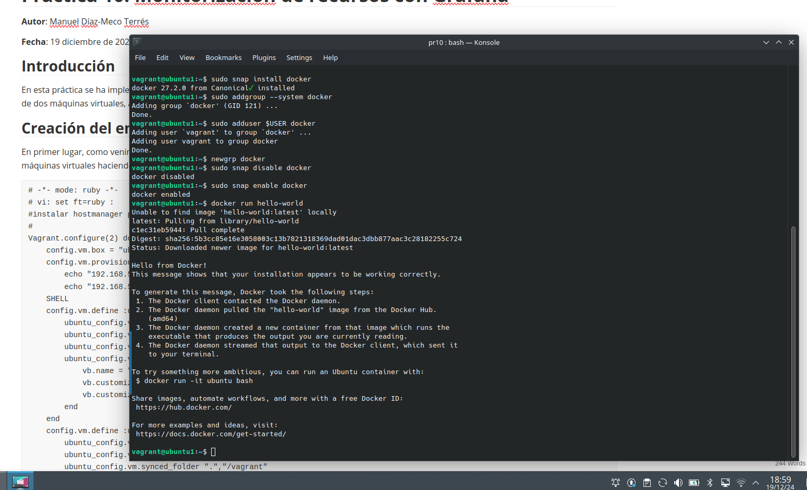

Una vez hemos probado que funciona docker y que está configurado para usarlo sin privilegios de superusuario. El `docker-compose.yml` es el siguiente:

```dockerfile
version: '3.6'

services:
  influxdb:
    image: influxdb:2.5.1-alpine
    container_name: influxdb
    restart: unless-stopped
    ports:
      - '8086:8086'
    volumes:
      - influxdb_data:/var/lib/influxdb2
    environment:
      - DOCKER_INFLUXDB_INIT_MODE=setup
      - DOCKER_INFLUXDB_INIT_USERNAME=admin
      - DOCKER_INFLUXDB_INIT_PASSWORD=supersecretpassword
      - DOCKER_INFLUXDB_INIT_ORG=my-org
      - DOCKER_INFLUXDB_INIT_BUCKET=my-bucket
      - DOCKER_INFLUXDB_INIT_RETENTION=1w


  grafana:
    image: grafana/grafana:latest
    container_name: grafana
    restart: unless-stopped
    depends_on:
      - influxdb
    ports:
      - '3000:3000'
    volumes:
      - grafana_data:/var/lib/grafana
    environment:
      - GF_SECURITY_ADMIN_USER=admin
      - GF_SECURITY_ADMIN_PASSWORD=admin1234
      - GF_INSTALL_PLUGINS=

volumes:
  influxdb_data:
  grafana_data:
```

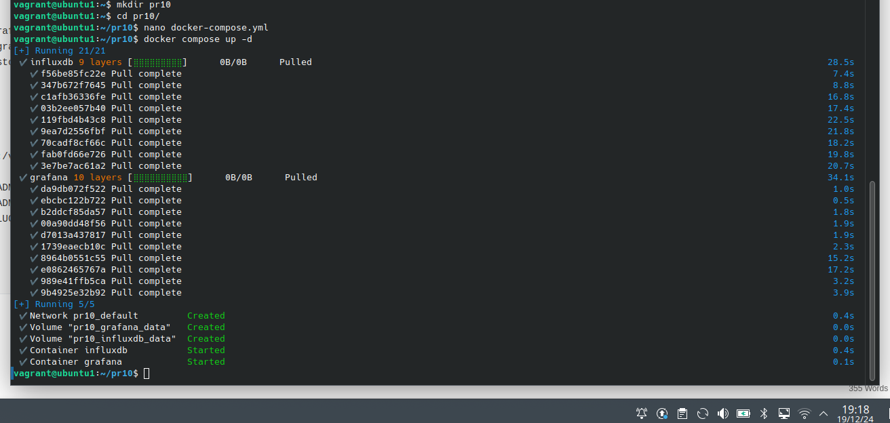

Accediendo a http://http://192.168.56.11:8086/ encontramos la página de registro de *InfluxDB*:

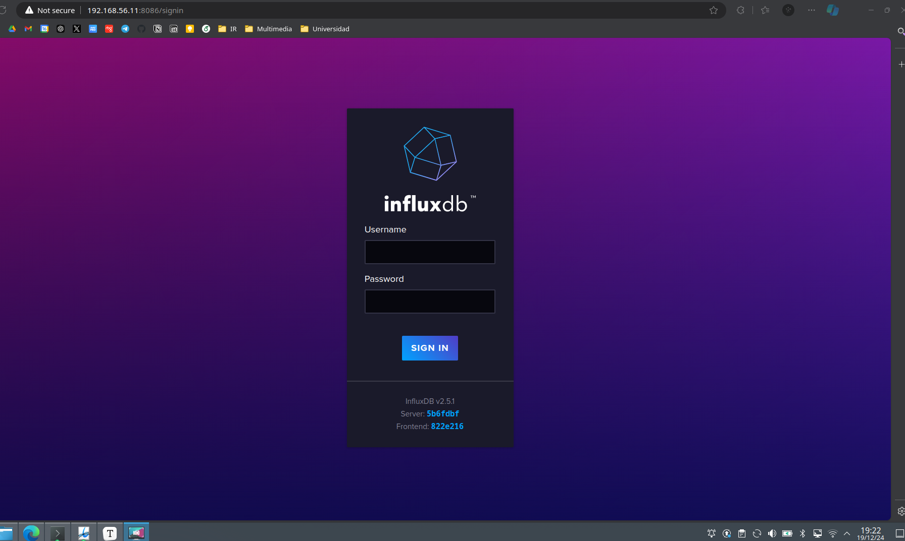

Accedemos con lo que hemos puesto en el dockerfile:

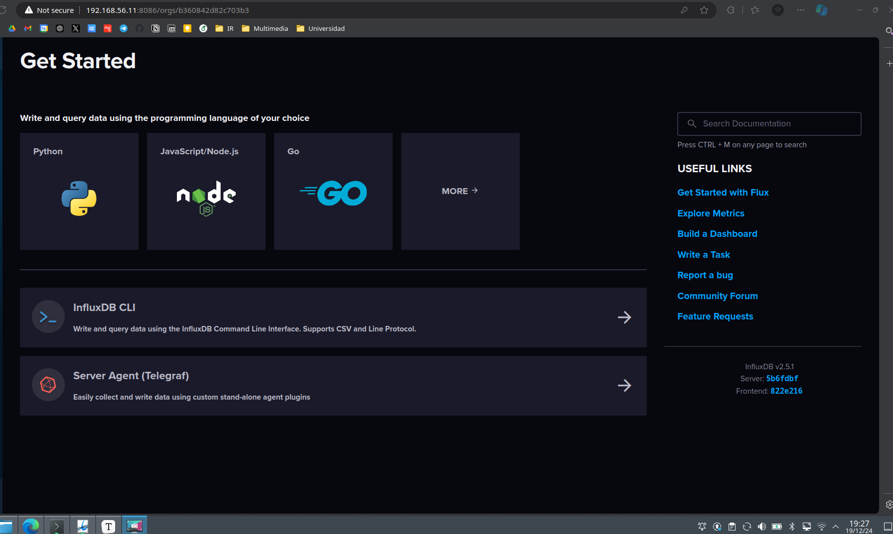

Ahora, en la sección de *Telegraf* creamos un token con todos los permisos que nos permitirá conectar ambos servicios. Ahora instalamos *Telegraf* en la máquina virtual siguiendo los comandos que se indican en su página web:

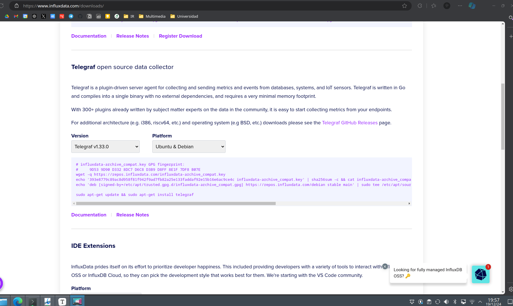

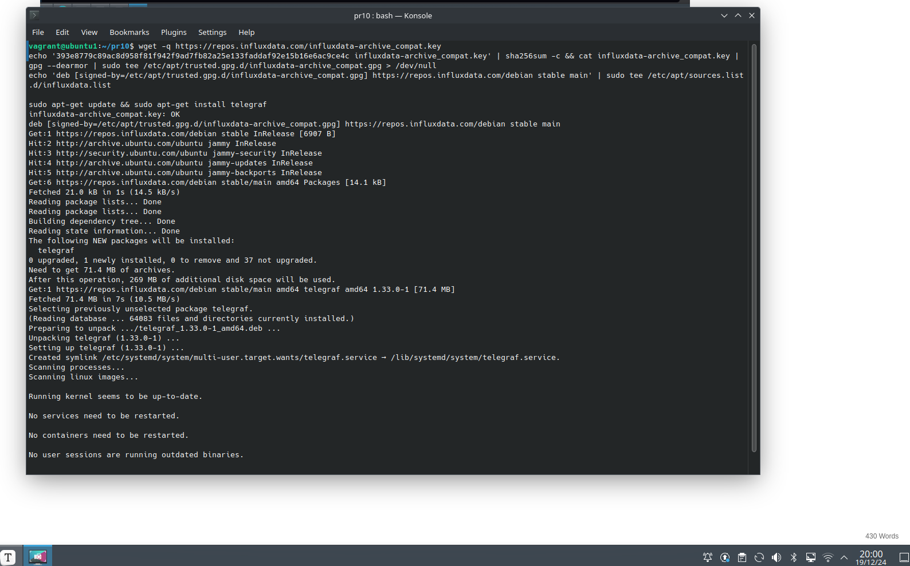

Para enlazar *Telegraf*  y *InfluxDB* tenemos que volver a la página de *InfluxDB*, acceder a la parte de `InfluxDB Output Plugin`

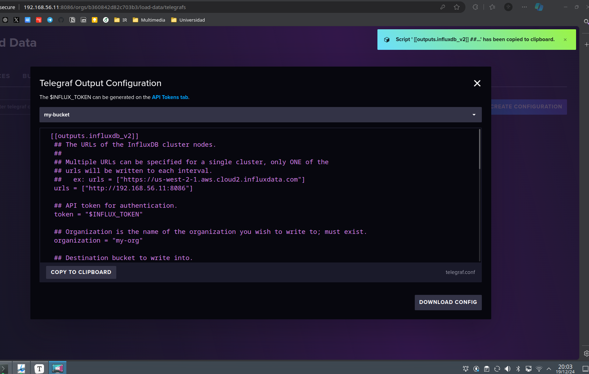

Ahora, copiamos lo que se nos da en el archivo `/etc/telegraf/telegraf.conf`:

```
###############################################
#             CPD PRACTICA 10                 #
###############################################


[[outputs.influxdb_v2]]
  ## The URLs of the InfluxDB cluster nodes.
  ##
  ## Multiple URLs can be specified for a single cluster, only ONE of the
  ## urls will be written to each interval.
  ##   ex: urls = ["https://us-west-2-1.aws.cloud2.influxdata.com"]
  urls = ["http://192.168.56.11:8086"]

  ## API token for authentication.
  token = "***********QCTmnh4kw-3jUORIcTr4FCChe863vX1jW2EL40VtD1GBzrRzL1YIF-AODXQ****************"

  ## Organization is the name of the organization you wish to write to; must exist.
  organization = "my-org"

  ## Destination bucket to write into.
  bucket = "my-bucket"

  ## The value of this tag will be used to determine the bucket.  If this
  ## tag is not set the 'bucket' option is used as the default.
  # bucket_tag = ""

  ## If true, the bucket tag will not be added to the metric.
  # exclude_bucket_tag = false

  ## Timeout for HTTP messages.
  # timeout = "5s"

  ## Additional HTTP headers
  # http_headers = {"X-Special-Header" = "Special-Value"}

  ## HTTP Proxy override, if unset values the standard proxy environment
  ## variables are consulted to determine which proxy, if any, should be used.
  # http_proxy = "http://corporate.proxy:3128"

  ## HTTP User-Agent
  # user_agent = "telegraf"

  ## Content-Encoding for write request body, can be set to "gzip" to
  ## compress body or "identity" to apply no encoding.
  # content_encoding = "gzip"

  ## Enable or disable uint support for writing uints influxdb 2.0.
  # influx_uint_support = false

  ## Optional TLS Config for use on HTTP connections.
  # tls_ca = "/etc/telegraf/ca.pem"
  # tls_cert = "/etc/telegraf/cert.pem"
  # tls_key = "/etc/telegraf/key.pem"
  ## Use TLS but skip chain & host verification
  # insecure_skip_verify = false


#################################################################################

```

Notar que he quitado algunos de los caracteres del token, lo más seguro sería utilizar una variable. Ahora, tenemos que añadir la configuración necesaria para poder hacer una monitorización de los datos que se quieran. En nuestro caso, vamos a utilizar los datos sobre nuestra CPU.

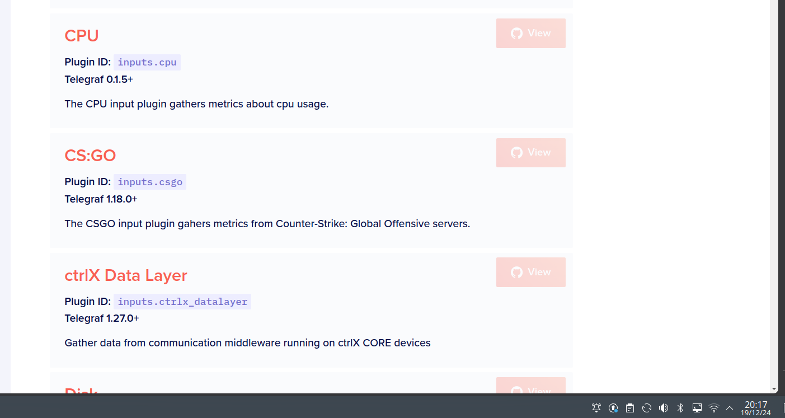

```
# Read metrics about cpu usage
[[inputs.cpu]]
  ## Whether to report per-cpu stats or not
  percpu = true
  ## Whether to report total system cpu stats or not
  totalcpu = true
  ## If true, collect raw CPU time metrics
  collect_cpu_time = false
  ## If true, compute and report the sum of all non-idle CPU states
  ## NOTE: The resulting 'time_active' field INCLUDES 'iowait'!
  report_active = false
  ## If true and the info is available then add core_id and physical_id tags
  core_tags = false
```

Una vez añadido esto último al archivo de configuración de *Telegraf* debemos iniciar el servicio para poder observar los resultados en *InfluxDB*

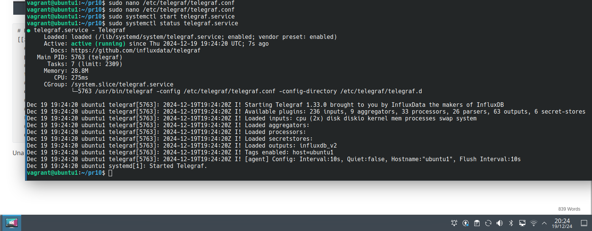

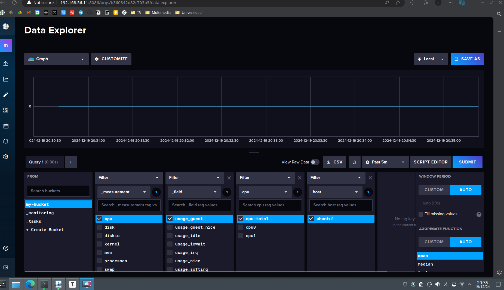

Ahora, debemos repetir el proceso de la instalación y configuración de *Telegraf* en la segunda máquina virtual. Obtemos entonces:

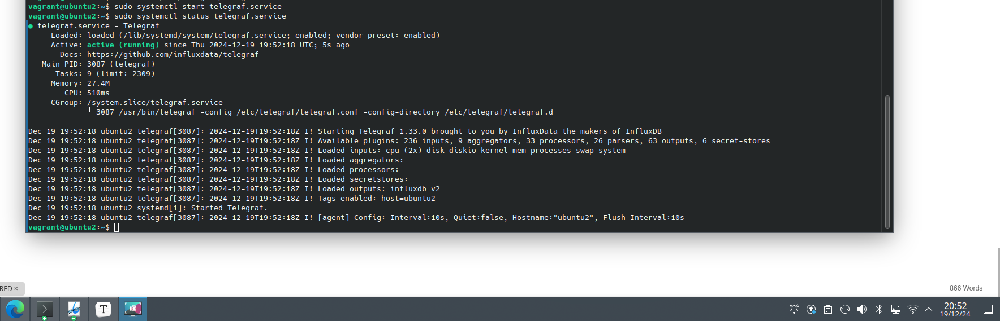

También esto se ve reflejado en nuestra base de datos:
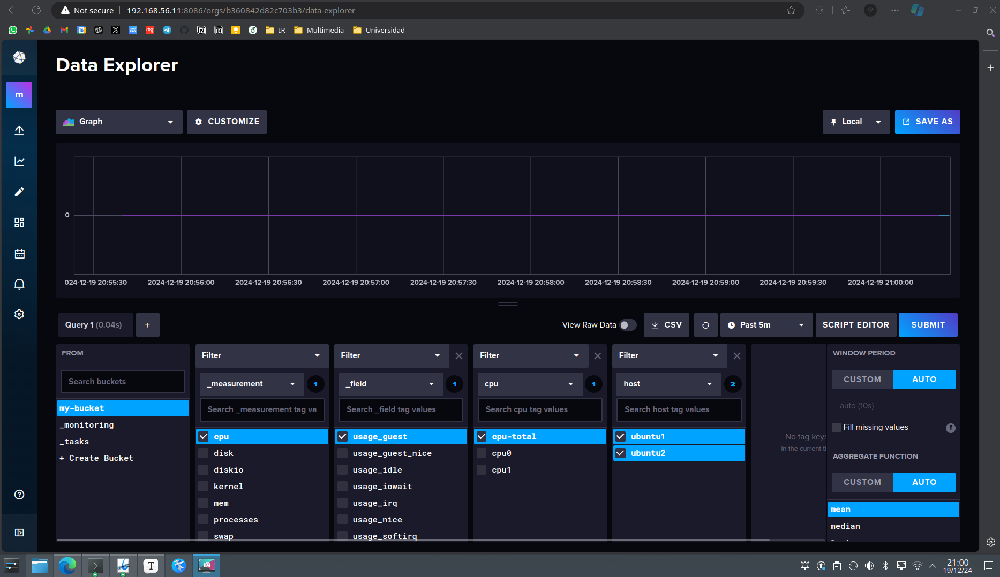

## Grafana

Pasamos ahora con la última parte, la de configurar *Grafana* para que muestre los datos recibidos de ambas máquinas. Para acceder a *Grafana* vamos a la dirección dada en el `docker-compose.yml`: http://192.168.56.11:3000

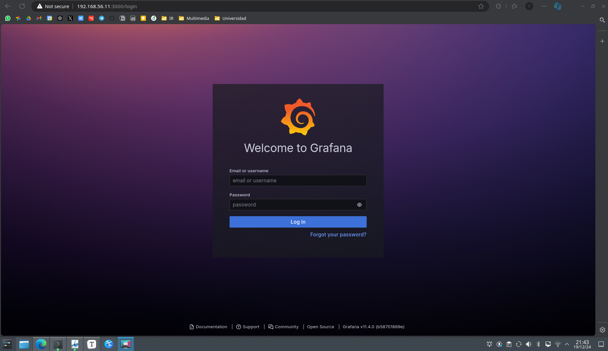

Accedemos, al igual que antes, con los parámetros del dockerfile. Una vez que ya estamos dentro hemos de acceder a *Connections --> Add New Conenction*, seleccionamos *InfluxDB* y lo configuramos como se muestra a continuación:

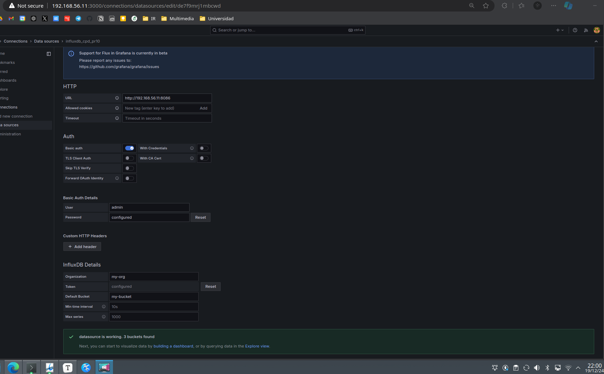

Ahora pinchamos donde aparece *'building a dashboard'* para poder crear la visualización de los datos. De primeras, no tendremos datos, es el momento de volver a la página de *InfluxDB* y copiar la *query* que se nos da para mostrar los datos de sendas máquinas virtuales ya configuradas, en nuestro caso:

```
from(bucket: "my-bucket")
  |> range(start: v.timeRangeStart, stop: v.timeRangeStop)
  |> filter(fn: (r) => r["_measurement"] == "cpu")
  |> filter(fn: (r) => r["_field"] == "usage_guest")
  |> filter(fn: (r) => r["cpu"] == "cpu-total")
  |> filter(fn: (r) => r["host"] == "ubuntu1" or r["host"] == "ubuntu2")
  |> aggregateWindow(every: v.windowPeriod, fn: mean, createEmpty: false)
  |> yield(name: "mean")
```

Copiamos esto mismo en el apartado de *query* de nuestro dashboard de *Grafana* y guardamos los cambios:

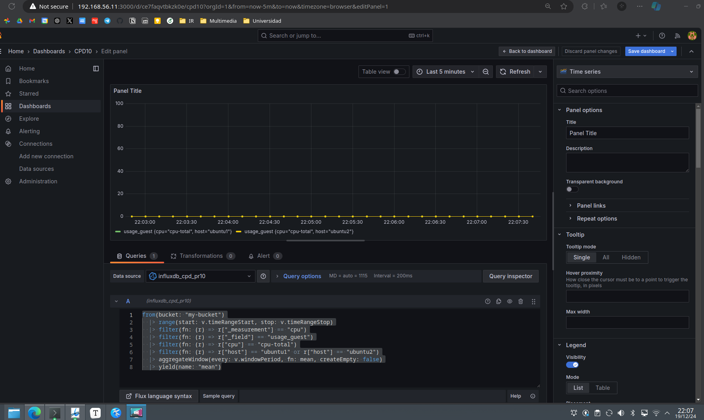

Con esto conseguimos un panel básico para poder visualizar los datos a través del uso de Grafana, Telegraf e InfluxDB. Podríamos añadir más puglins de visualización, ya sabemos que Grafana es una potente herramienta en este aspecto.