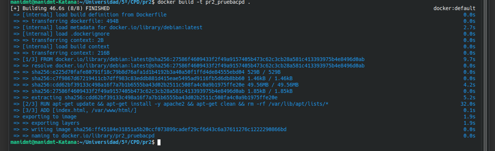
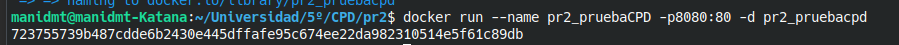
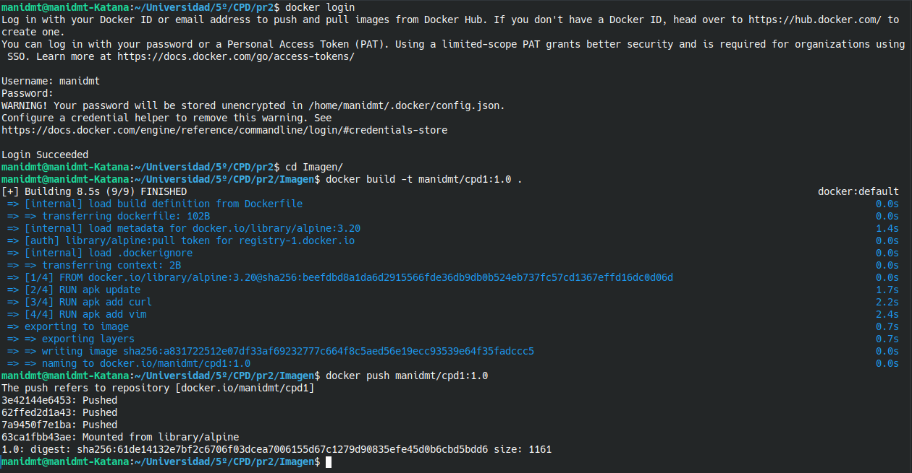
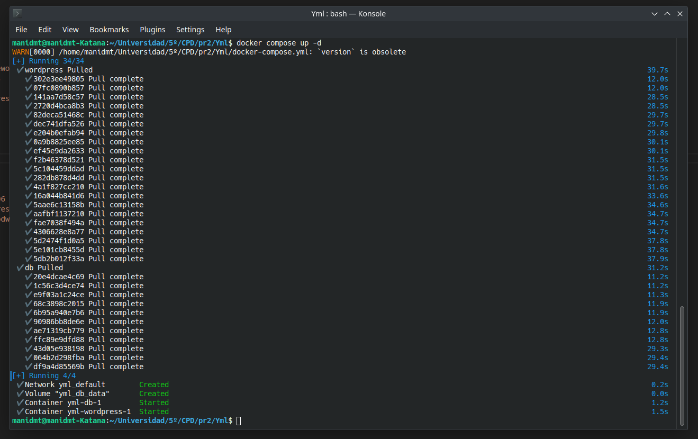
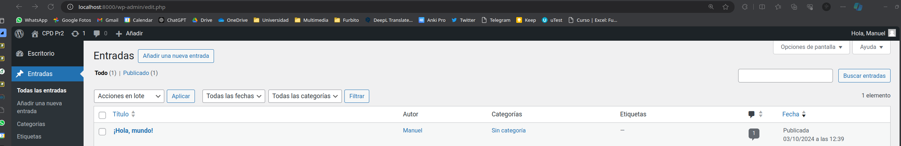
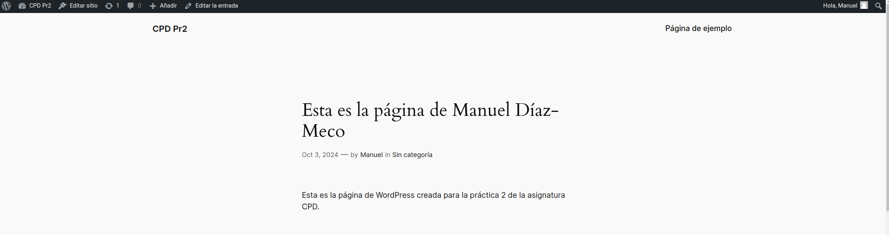
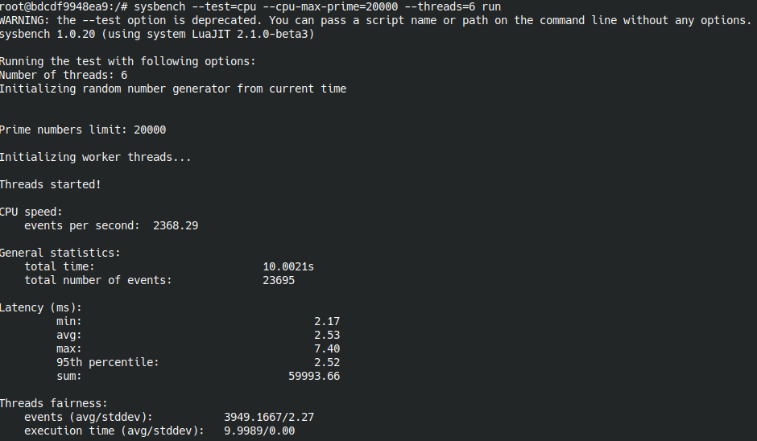
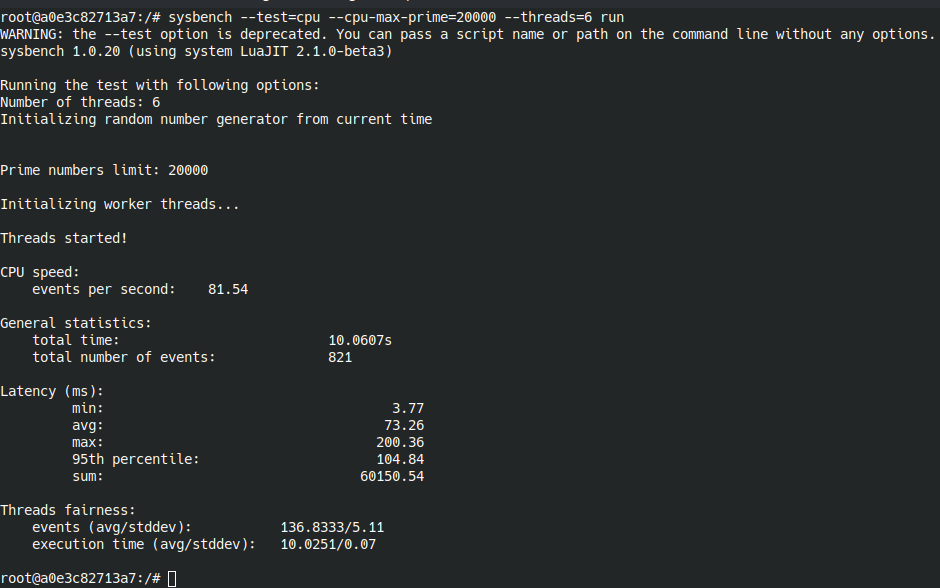
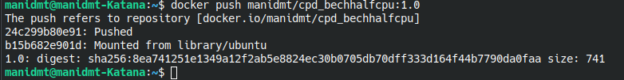
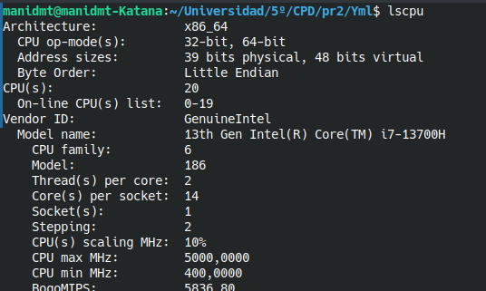

# Práctica 2: Contenedores Docker y Docker Compose

**Autor:** Manuel Díaz-Meco  
**Fecha:** 3 de octubre de 2024

---

## Introducción

El objetivo de esta práctica es trabajar con Docker para la creación de imágenes personalizadas, su publicación en Docker Hub, y el despliegue de múltiples contenedores utilizando Docker-compose. Además, se realizará una prueba opcional de limitación de CPU y la subida del contenedor con los resultados obtenidos a Docker Hub.

---

## Apartado 1: Crear una imagen Docker personalizada con Apache

En este apartado se crea una imagen que contiene Apache y un archivo personalizado `index.html` para ser servido en el puerto 8080. Estos han sido los comandos utilizados para construir y ejecutar el contenedor:

### Comandos utilizados:

```bash
docker build -t pr2_pruebacpd .
docker run --name pr2_pruebaCPD -p8080:80 -d pr2_pruebacpd
```

Donde el archivo `index.html` ha sido el siguiente, siguiendo el guión:

### index.html

```html
<!DOCTYPE html>
<html lang="en">
<head>
    <meta charset="UTF-8">
    <title>Prueba CPD</title>
</head>
<body>
    <h1>Prueba inicial CPD, Manuel Diaz-Meco</h1>
</body>
</html>
```

Y el archivo `Dockerfile` ha sido:

### Dockerfile

```dockerfile
FROM debian
# Parece ser que MAINTAINER está obsoleto
LABEL maintainer.name = "Manuel"
LABEL maintainer.email =  "<manidmt5@correo.ugr.es>"
# Instalamos apache2
RUN apt-get update && apt-get install -y apache2 && apt-get clean && rm -rf /var/lib/apt/lists/*
ENV APACHE_RUN_USER www-data
ENV APACHE_RUN_GROUP www-data
ENV APACHE_LOG_DIR /var/log/apache2
EXPOSE 80
ADD ["index.html", "/var/www/html/"]
ENTRYPOINT ["/usr/sbin/apache2ctl", "-D", "FOREGROUND"]
```


### Capturas de pantalla:





---

## Apartado 2: Publicar la imagen en Docker Hub

En este apartado se publica la imagen construida en Docker Hub para que pueda ser utilizada desde cualquier lugar. El comando utilizado para la publicación fue el siguiente:

### Comando utilizado:

```bash
docker push manidmt/pr2_pruebaCPD:1.0
```

### Captura de pantalla:



---

## Apartado 3: Desplegar un servidor Wordpress con Docker-compose

En este apartado se ha creado la correspondiente imagen para crear un servidor Wordpress, que luego se edita para que salga mi nombre, a través de `docker-compose` El archivo `docker-compose.yml` utilizado es el siguiente:

### docker-compose.yml:

```yaml
version: '3'
services:
  db:
    image: mysql:5.7
    volumes:
      - db_data:/var/lib/mysql
    restart: always
    environment:
      MYSQL_ROOT_PASSWORD: somewordpress
      MYSQL_DATABASE: wordpress
      MYSQL_USER: wordpress
      MYSQL_PASSWORD: wordpress

  wordpress:
    depends_on:
      - db
    image: wordpress:latest
    ports:
      - "8000:80"
    restart: always
    environment:
      WORDPRESS_DB_HOST: db:3306
      WORDPRESS_DB_USER: wordpress
      WORDPRESS_DB_PASSWORD: wordpress
      WORDPRESS_DB_NAME: wordpress
volumes:
  db_data:
```

### Comando para ejecutar:

```bash
docker-compose up -d
```

### Capturas de pantalla:







---

## Apartado 4: Limitar el uso de CPU y realizar un benchmark

En este apartado opcional, se limitó el uso de CPU y se ejecutó el benchmark de CPU usando la herramienta `sysbench`, previamente instalada en el contenedor. A continuación se muestran los comandos utilizados y los resultados obtenidos.

### Comando para ejecutar el benchmark sin limitación de CPU:

```bash
sysbench --test=cpu --cpu-max-prime=20000 --threads=6 run
```

### Comando para ejecutar el benchmark con limitación de CPU (0.5 CPUs):

```bash
docker run --cpus=".5" ubuntu /bin/bash
sysbench --test=cpu --cpu-max-prime=20000 --threads=6 run
```

### Capturas de pantalla:









---