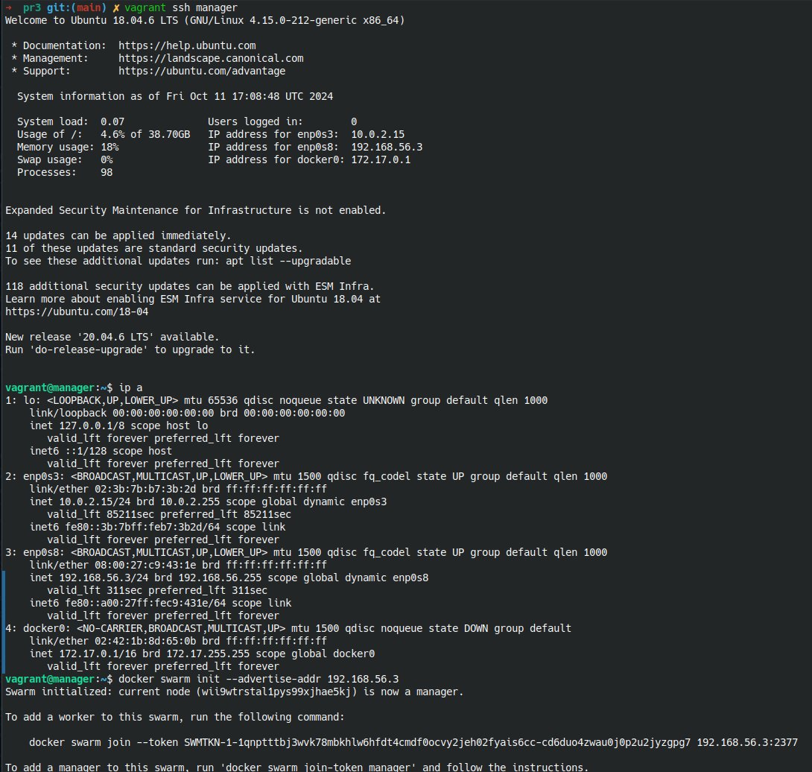
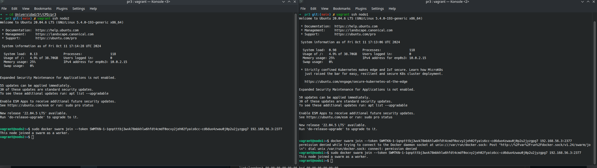
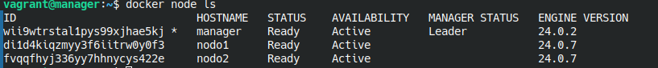

# Práctica 3: Docker Swarm

**Autor:** Manuel Díaz-Meco Terrés

**Fecha:** 12 de octubre de 2024

## Introducción

El objetivo de esta práctica es trabajar con Docker para la creación de imágenes personalizadas, su publicación en Docker Hub, y el despliegue de múltiples contenedores utilizando Docker-compose. Además, se realizará una prueba opcional de limitación de CPU y la subida del contenedor con los resultados obtenidos a Docker Hub.

---

## Ejecución del Servicio Web

En este apartado se crea el *swarm* en uno de los nodos y en los otros 2 se ejecuta el comando necesario para unirse al nodo creador o *manager*. A continuación se muestran las imágenes y los comandos utilizados:

### Comandos utilizados:

**Nodo manager:**

```bash
docker swarm init --advertise-addr 192.168.0.8
docker node ls
```

**Nodos worker:**

```bash
docker swarm join --token SWMTKN-1-2aok4di4sqaske27u0qsgnxs752k5h3jcnbzrz77khjb6u6joh-ejf7500zglosb3dwy6q9chwtk 192.168.0.8:2377
```


### Capturas de pantalla:


---

## Cambio de Escala

En este apartado se muestra como afecta el cambio de escala a la hora de la ejecución del sistema "web". Notar que el aviso `No such image: nginx latest`es porque intenté ejecutar los comandos para lanzar el servicio web sin tener instalado ngnix en los nodos.

### Comandos Utilizados:

```bash
docker service ps web
docker service scale web=2
docker service ps web
```

### Capturas de Pantalla:


## Ejecución de un único Nodo activación automática del segundo Nodo

En este apartado lo que se hace es borrar los nodos 2 y 3 y cambiar de escala para que el servicio web se adapte al uso de un único nodo, el *manager*. Tras crear un nuevo nodo y configurarlo como antes rehacemos el cambio de escala y hacemos que use 2 nodos nuevamente. Podemos ver en las capturas que hay 2 node2, uno apagado y otro listo para ser usado.

### Comandos Utilizados:

```bash
docker service scale web=1
docker node ls
docker service ps web
docker service scale web=2
docker service ps web
```

### Capturas de Pantalla:


## Apartado Opcional con Vagrant

Para este último apartado vamos a generar los nodos y el manager a partir del uso de vagrant y virtualbox, en vez de usar la página web que se muestra en las prácticas y que he utilizado anteriormente. Tras instalar Vagrant y VirtualBox se crea un archivo Vagrantfile en el directorio donde estabamos desarrollando la práctica.

```Vagrantfile
Vagrant.configure("2") do |config|
# Configuración del nodo manager
config.vm.define "manager" do |manager|
    manager.vm.box = "ubuntu/focal64"
    manager.vm.network "private_network", type: "dhcp"
    manager.vm.hostname = "manager"
    manager.vm.provider "virtualbox" do |vb|
    vb.memory = "1024"
    end

    manager.vm.synced_folder ".", "/vagrant", disabled: true

    manager.vm.provision "shell", inline: <<-SHELL
    sudo apt-get update
    sudo apt-get install -y docker.io
    sudo docker swarm init --advertise-addr $(hostname -I | cut -d' ' -f1)
    SHELL
end

# Configuración de los nodos
(1..2).each do |i|
    config.vm.define "nodo#{i}" do |worker|
    worker.vm.box = "ubuntu/focal64"
    worker.vm.network "private_network", type: "dhcp"
    worker.vm.hostname = "nodo#{i}"
    worker.vm.provider "virtualbox" do |vb|
        vb.memory = "1024"
    end

    worker.vm.synced_folder ".", "/vagrant", disabled: true

    worker.vm.provision "shell", inline: <<-SHELL
        sudo apt-get update
        sudo apt-get install -y docker.io
    SHELL
    end
end
end
```

### Comandos Utilizados:

**En mi máquina principal:**

```bash
vagrant up
vagrant ssh manager
vagrant ssh nodo1
vagrant ssh nodo2
```

**En el nodo manager:**

```bash
docker swarm init --advertise-addr 192.168.56.3
docker node ls
```

**En los nodos:**

```bash
sudo docker swarm join --token SWMTKN-1-1qnptttbj3wvk78mbkhlw6hfdt4cmdf0ocvy2jeh02fyais6cc-cd6duo4zwau0j0p2u2jyzgpg7 192.168.56.3:2377
```

### Capturas de Pantalla:







