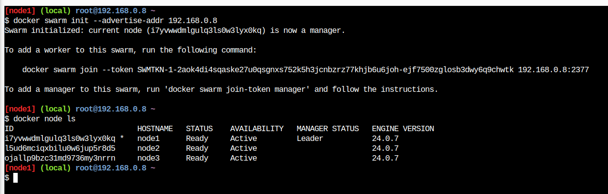

# Práctica 3: Docker Swarm

**Autor:** Manuel Díaz-Meco Terrés

**Fecha:** 4 de octubre de 2024

## Introducción

El objetivo de esta práctica es trabajar con Docker para la creación de imágenes personalizadas, su publicación en Docker Hub, y el despliegue de múltiples contenedores utilizando Docker-compose. Además, se realizará una prueba opcional de limitación de CPU y la subida del contenedor con los resultados obtenidos a Docker Hub.

---

## Ejecución del Servicio Web

En este apartado se crea una imagen que contiene Apache y un archivo personalizado `index.html` para ser servido en el puerto 8080. Estos han sido los comandos utilizados para construir y ejecutar el contenedor:

### Comandos utilizados:

**Nodo manager:**

```bash
docker swarm init --advertise-addr 192.168.0.8
docker node ls
```

**Nodos worker:**

```bash
docker swarm join --token SWMTKN-1-2aok4di4sqaske27u0qsgnxs752k5h3jcnbzrz77khjb6u6joh-ejf7500zglosb3dwy6q9chwtk 192.168.0.8:2377
```


### Capturas de pantalla:




---

## Cambio de Escala

En este apartado se muestra como afecta el cambio de escala a la hora de la ejecución del sistema "web". Notar que el aviso `No such image: nginx latest`es porque intenté ejecutar los comandos para lanzar el servicio web sin tener instalado ngnix en los nodos.

### Comandos Utilizados:

```bash
docker service ps web
docker service scale web=2
docker service ps web
```

### Capturas de Pantalla:


## Ejecución de un único Nodo activación automática del segundo Nodo

En este apartado lo que se hace es borrar los nodos 2 y 3 y cambiar de escala para que el servicio web se adapte al uso de un único nodo, el *manager*. Tras crear un nuevo nodo y configurarlo como antes rehacemos el cambio de escala y hacemos que use 2 nodos nuevamente. Podemos ver en las capturas que hay 2 node2, uno apagado y otro listo para ser usado.

### Comandos Utilizados:

```bash
docker service scale web=1
docker node ls
docker service ps web
docker service scale web=2
docker service ps web
```

### Capturas de Pantalla:


