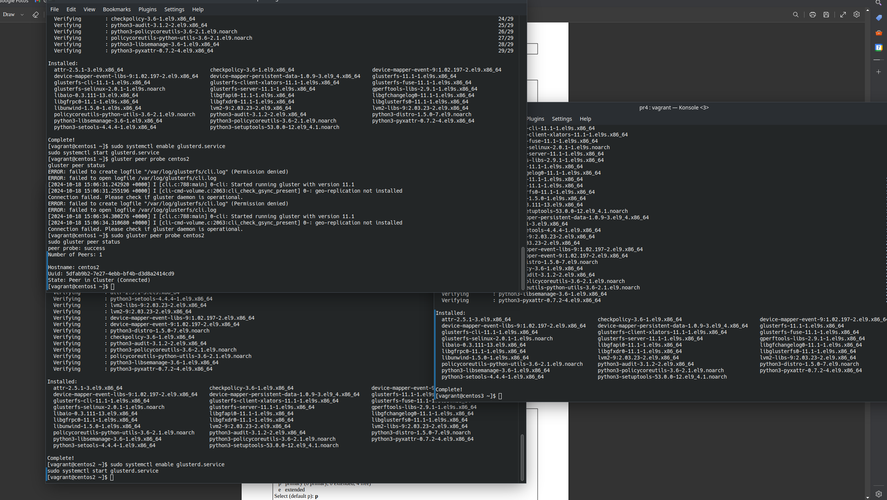
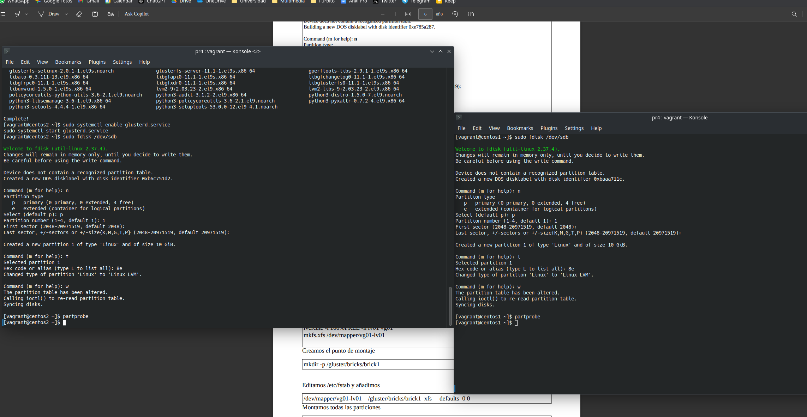
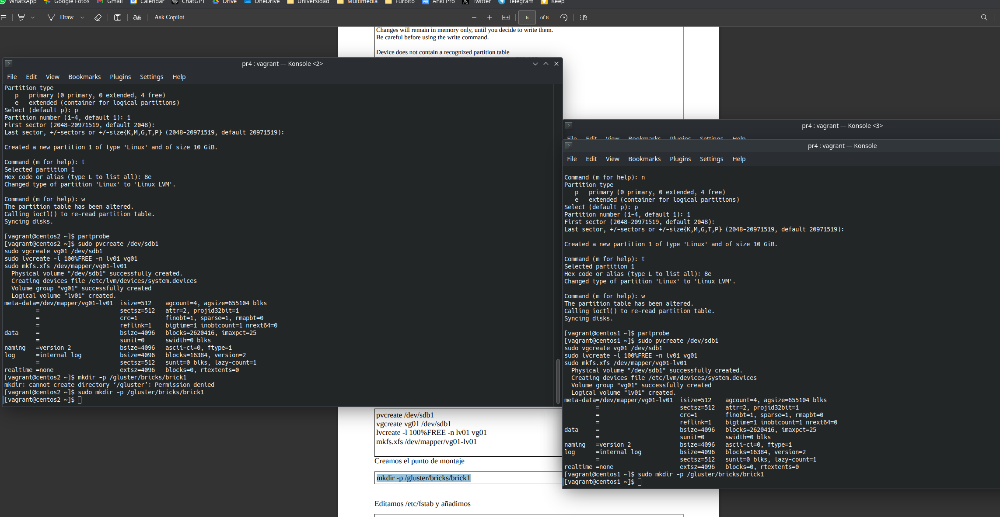
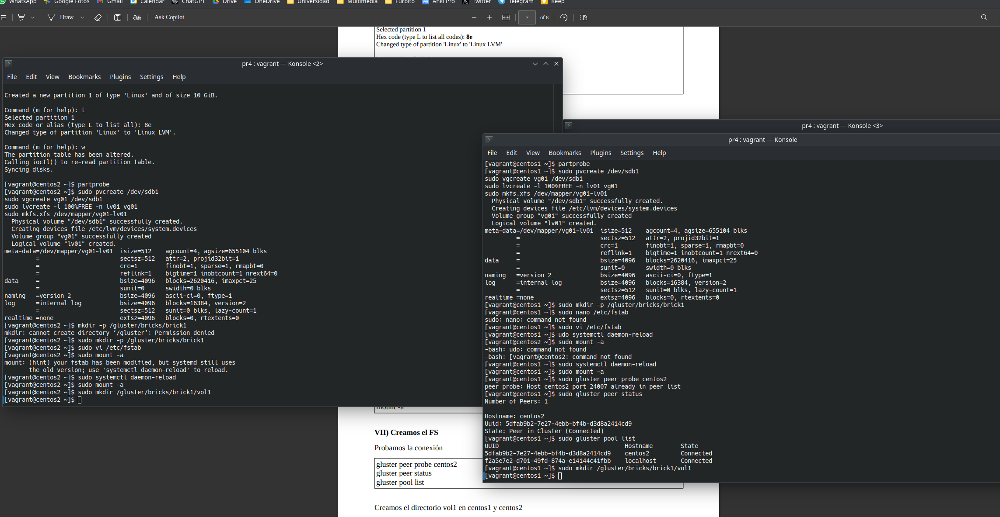
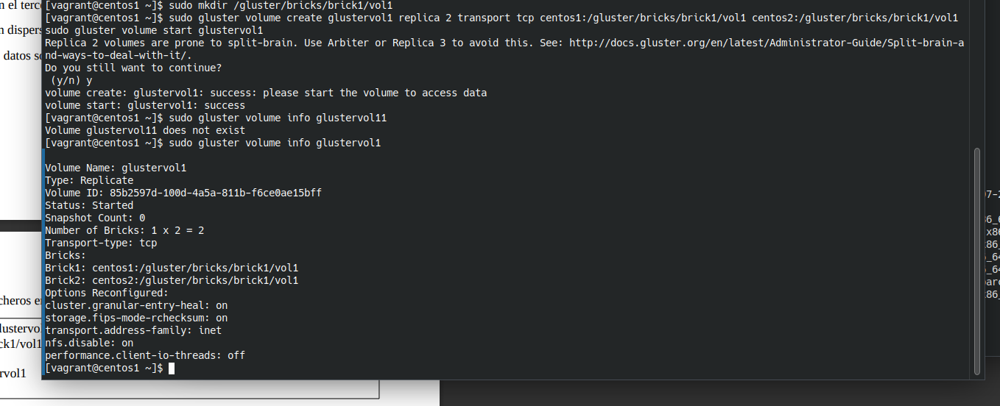
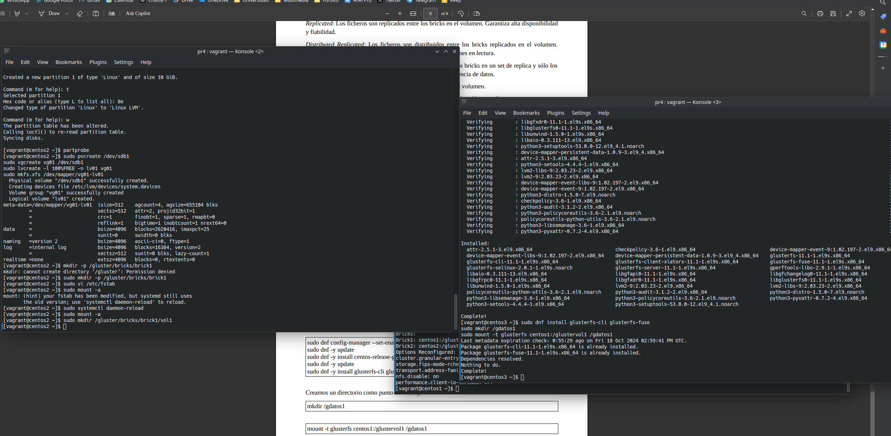
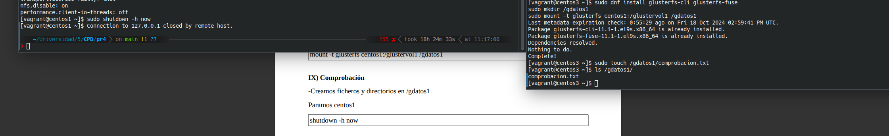
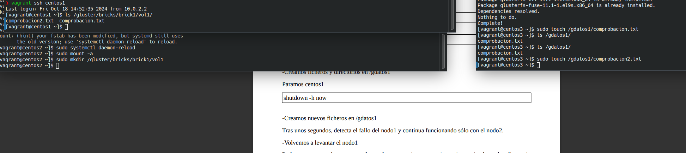

# Práctica 4: Configuración GlusterFS

**Autor:** Manuel Díaz-Meco Terrés   

**Fecha:** 18 de octubre de 2024 

## Introducción

El objetivo de esta práctica es implementar un sistema de almacenamiento distribuido y replicado con GlusterFS. Se utilizarán tres nodos de CentOS creados con Vagrant, dos de los cuales funcionarán como servidores replicados, y uno como cliente.

## Creación de las Máquinas Virtuales

A partir del Vagrantfile que se da en SWAD creamos las máquinas virtuales haciendo uso del comando `vagrant up`.

Tras la correcta creación de las 3 máquinas virtuales se ejecuta, para cada una de ellas, lo siguientes comandos:

```bash
vagrant ssh centos1
sudo def config-manager --set-enabled crb
sudo dnf update
sudo search centos-release-gluster
sudo dnf -y install centos-release-gluster11
sudo dnf -y update
sudo dnf -y install glusterfs glusterfs-cli glusterfs-libs glusterfs-server
```

 

## Inicialización de Servicios y Creación de los Bricks y FS

Inicializamos los servicios en centos1 y centos2 como indica el guión:

```bash
sudo systemctl enable glusterd.service
sudo systemctl start glusterd.service
sudo gluster peer probe centos2
sudo gluster peer status
```



A continuación, creamos los bricks para montar los FS:

```bash
sudo fdisk /dev/sdb
sudo pvcreate /dev/sdb1
sudo vgcreate vg01 /dev/sdb1
sudo lvcreate -l 100%FREE -n lv01 vg01
sudo mkfs.xfs /dev/mapper/vg01-lv01
sudo mkdir -p /gluster/bricks/brick1
```





Editamos el archivo `/etc/stab` y montamos. Tras montar creamos el FS en centos1 y 2:

```bash
sudo gluster peer probe centos2
sudo gluster peer status
sudo gluster pool list
sudo mkdir /gluster/bricks/brick1/vol1
```



Ahora creamos el volumen cluster:

```bash
sudo gluster volume create glustervol1 replica 2 transport tcp centos1:/gluster/bricks/brick1/vol1 centos2:/gluster/bricks/brick1/vol1
sudo gluster volume start glustervol1
sudo gluster volume info glustervol1
```



## Instalación del Cliente en CentOS3 y Comprobación

```bash
sudo dnf config-manager --set-enabled crb
sudo dnf -y update
sudo dnf -y install centos-release-gluster11
sudo dnf -y update
sudo dnf -y install glusterfs-cli glusterfs-fuse
mkdir /gdatos1
mount -t glusterfs centos1:/glustervol1 /gdatos1
```



Para comprobar creamos un archivo en centos3 y a continuación apagamos centos1:



Mientras que la máquina centos1 está apagada, creamos otro archivo de comprobación. Después de crearlo volvemos a levantar centos1 para verificar que la sincronización de los datos es correcta:



## Apartado Opcional

En este apartado se pedía configurar el Vagrantfile para que se instale automáticamente GlusterFS en cada nodo servidor.

```Vagrantfile
# -*- mode: ruby -*-
# vi: set ft=ruby :
#instalar hostmanager plugin
#
DIRCPD = '.'

disk1 = DIRCPD + "/disk1.vdi"
disk2 = DIRCPD + "/disk2.vdi"
disk3 = DIRCPD + "/disk3.vdi"

Vagrant.configure(2) do |config|
  config.vm.box = "rockylinux/9"
  
  # Aprovisionamiento común para las máquinas
  config.vm.provision "shell", inline: <<-SHELL
        sed -i 's/PasswordAuthentication no/PasswordAuthentication yes/' /etc/ssh/sshd_config
        systemctl restart sshd.service
        dnf -y update
        echo "192.168.56.11 centos1" >> /etc/hosts
        echo "192.168.56.12 centos2" >> /etc/hosts
        echo "192.168.56.13 centos3" >> /etc/hosts
  SHELL
  
  config.vm.define :centos1 do |centos_config|
      centos_config.vm.hostname = "centos1.vm"
      centos_config.vm.network "private_network", ip:"192.168.56.11"
      centos_config.vm.synced_folder ".", "/vagrant"
      centos_config.vm.provider :virtualbox do |vb|
          vb.name = "centos1"
          vb.customize ["modifyvm", :id, "--memory", "1024"]
          vb.customize ["modifyvm", :id, "--cpus", "1"]
          unless File.exist?(disk1)
            vb.customize ['createhd', '--filename', disk1, '--size', 10 * 1024]
            vb.customize ['storageattach', :id, '--storagectl', 'IDE Controller', '--port', 1, '--device', 0, '--type', 'hdd', '--medium', disk1]
          end
      end
      # Provisioning para instalar GlusterFS en centos1
      centos_config.vm.provision "shell", inline: <<-SHELL
        sudo dnf install -y glusterfs-server glusterfs-cli glusterfs-fuse
        sudo systemctl enable glusterd.service
        sudo systemctl start glusterd.service
      SHELL
  end

  config.vm.define :centos2 do |centos_config|
      centos_config.vm.hostname = "centos2.vm"
      centos_config.vm.network "private_network", ip:"192.168.56.12"
      centos_config.vm.synced_folder ".", "/vagrant"
      centos_config.vm.provider :virtualbox do |vb|
          vb.name = "centos2"
          vb.customize ["modifyvm", :id, "--memory", "1024"]
          vb.customize ["modifyvm", :id, "--cpus", "1"]
          unless File.exist?(disk2)
            vb.customize ['createhd', '--filename', disk2, '--size', 10 * 1024]
            vb.customize ['storageattach', :id, '--storagectl', 'IDE Controller', '--port', 1, '--device', 0, '--type', 'hdd', '--medium', disk2]
          end
      end
      # Provisioning para instalar GlusterFS en centos2
      centos_config.vm.provision "shell", inline: <<-SHELL
        sudo dnf install -y glusterfs-server glusterfs-cli glusterfs-fuse
        sudo systemctl enable glusterd.service
        sudo systemctl start glusterd.service
      SHELL
  end

  config.vm.define :centos3 do |centos_config|
      centos_config.vm.hostname = "centos3.vm"
      centos_config.vm.network "private_network", ip:"192.168.56.13"
      centos_config.vm.synced_folder ".", "/vagrant"
      centos_config.vm.provider :virtualbox do |vb|
          vb.name = "centos3"
          vb.customize ["modifyvm", :id, "--memory", "1024"]
          vb.customize ["modifyvm", :id, "--cpus", "1"]
          unless File.exist?(disk3)
            vb.customize ['createhd', '--filename', disk3, '--size', 10 * 1024]
            vb.customize ['storageattach', :id, '--storagectl', 'IDE Controller', '--port', 1, '--device', 0, '--type', 'hdd', '--medium', disk3]
          end
      end
      # Provisioning para instalar GlusterFS en centos3
      centos_config.vm.provision "shell", inline: <<-SHELL
        sudo dnf install -y glusterfs-cli glusterfs-fuse
        sudo mkdir /gdatos1
      SHELL
  end

end

```

