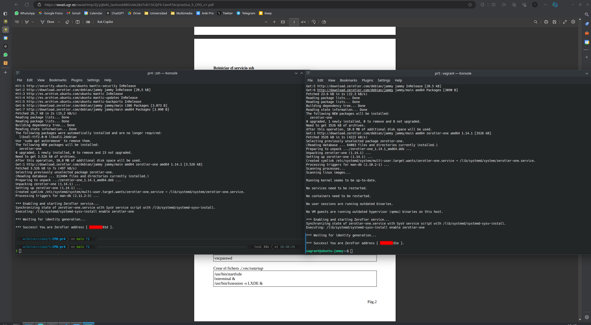
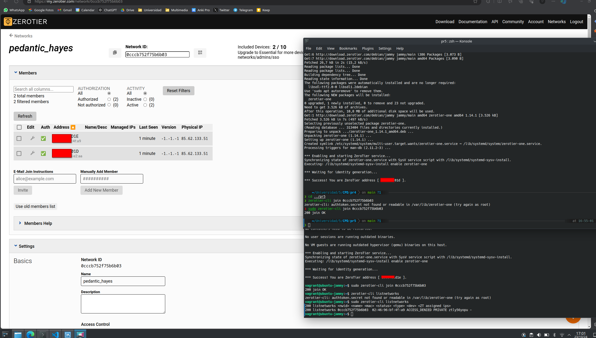
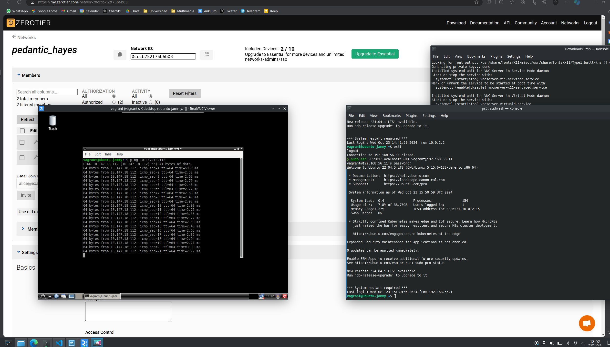
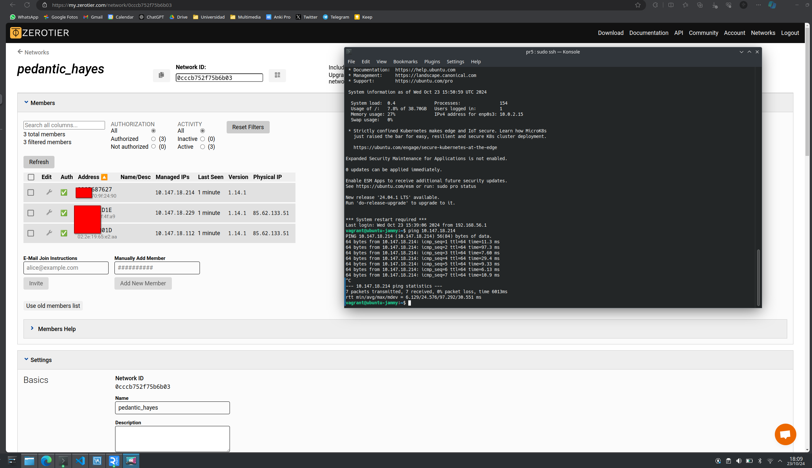
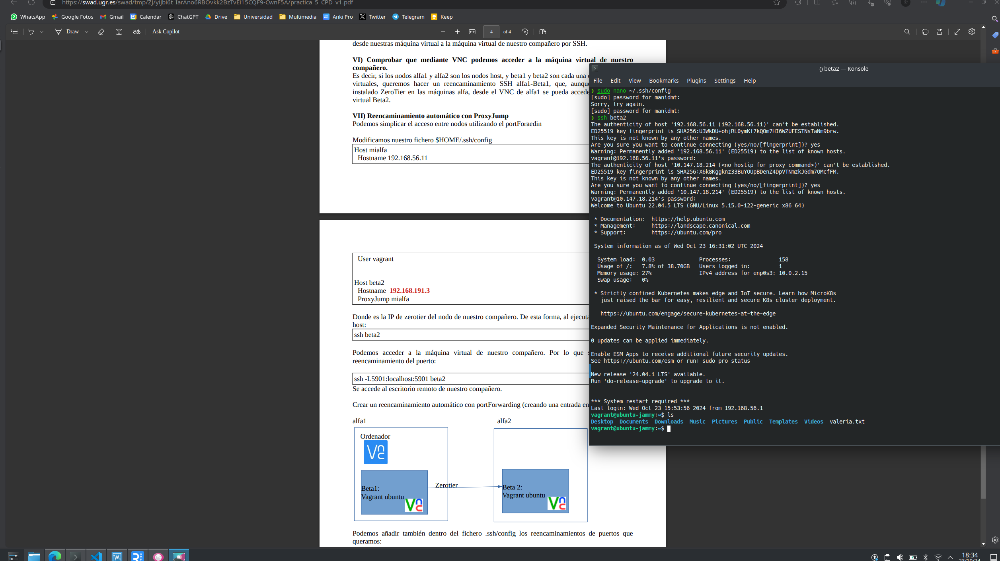
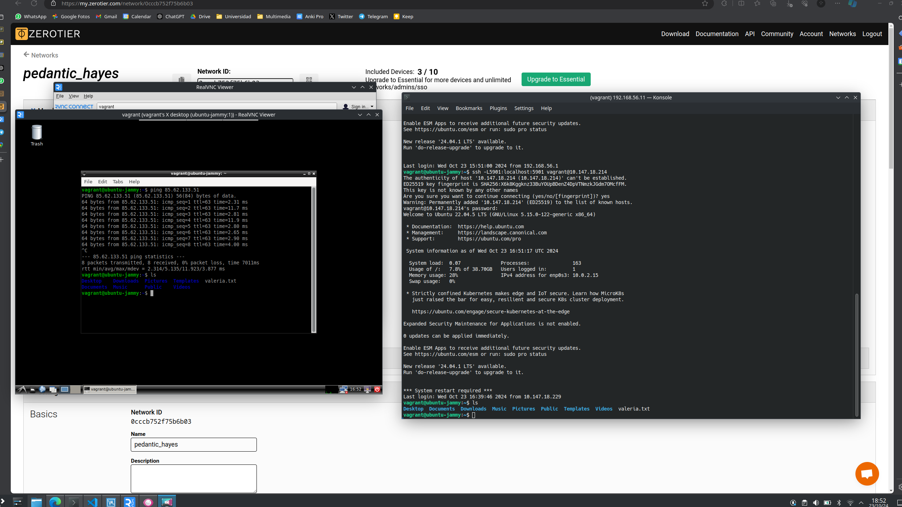

# Práctica 5: Acceso Remoto

**Autor:** Manuel Díaz-Meco Terrés

**Fecha:** 25 de octubre 2024

**Compañera:** Valeria Borrajo Yusty

## Introducción

El objetivo de esta práctica es conectar diversas máquinas a través de túneles *ssh* y el uso de *ZeroTier*

## Instalación y configuración de los nodos ZeroTier

Tras crear nuestra máquina virtual a través del archivo `Vagratfile` dado debemos instalar *ZeroTier* en el host y en la máquina vittual y crear una cuenta en la página web oficial donde se administrarán los nodos que se unan a la red.



Una vez lo tenemos instalado, hemos de ejecutar el comando `zerotier-cli join` para que ambas máquinas se unan a la red creada.



## Acceso mediante VNC

Ahora, tras instalar el entorno gráfico en la máquina virtual mediante los comandos expuestos en la prática ejecutamos `ssh -L5901:localhost:5901 vagrant@192.168.56.11`y podemos observar con éxito en la imagen la conexión a la máquina virtual.



## Con la Compañera

En primer lugar, la compañera y yo debemos estar en la misma red *ZeroTier*.



Una vez que ambos nos encontramos en la misma red *ZeroTier* ya podemos realizar tanto la conexión por *ssh* como por *VNC*.



Notar que en mi máquina virtual se ha creado un archivo txt llamado `manolo.txt` y en la suya se ha creado el fichero `valeria.txt` para poder distinguir en qué máquina virtual nos encontramos.

Para la parte del reencaminamiento utilicé el siguiente archivo:

```config
Host mialfa
	Hostname 192.168.56.11
	User vagrant

Host beta2
	Hostname 10.147.18.214
	ProxyJump mialfa
```

Y aunque es cierto que al hacer `ssh beta2` sí se establecía la conexión con la máquina virtual de la compañera, no conseguimos que esto funcionase para *VNC*, por lo que tuvimos que hacer el reencaminamiento de manera 'manual'. Lo que hicimos fue reencaminar el puerto 5901 a mi máquina virtual, como habíamos hecho antes, y dentro de mi máquina virtual, reencaminar nuevamente el puerto 5901 a la máquina virtual de la compañera.

Es decir, primero ejecutar `ssh -L5901:localhost:5901 vagrant@192.168.56.11` en mi host como antes. Luego ejecutar `ssh -L5901:localhost:5901 vagrant@10.147.18.214` en mi máquina virtual. Consiguiendo así la correcta comunicación reflejada en *RealVNC*.

