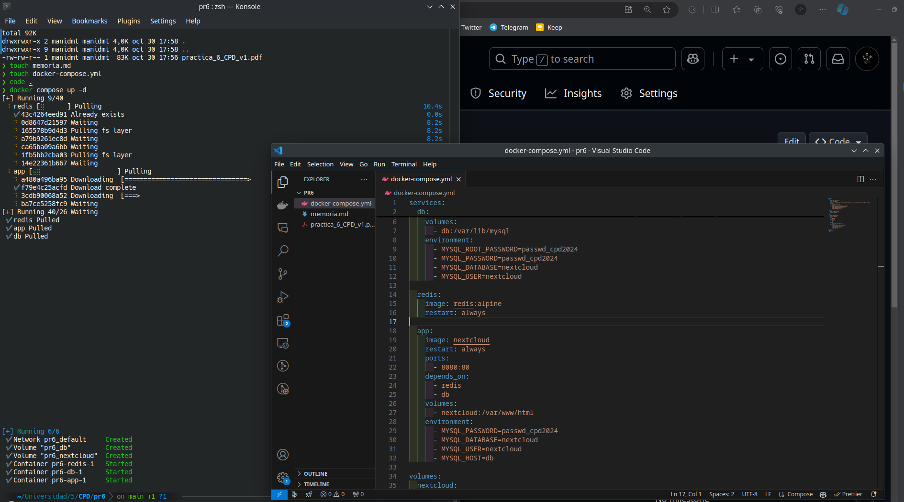
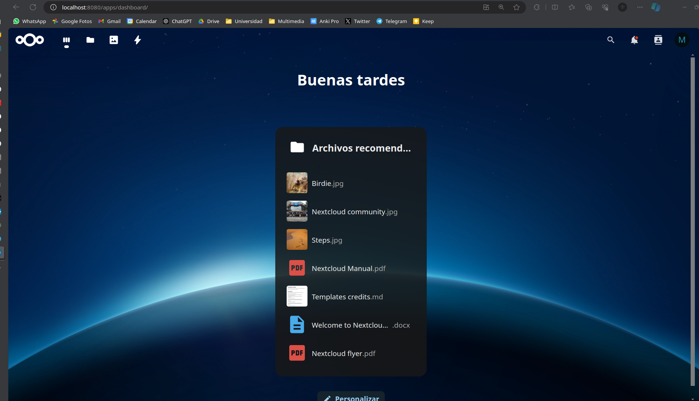
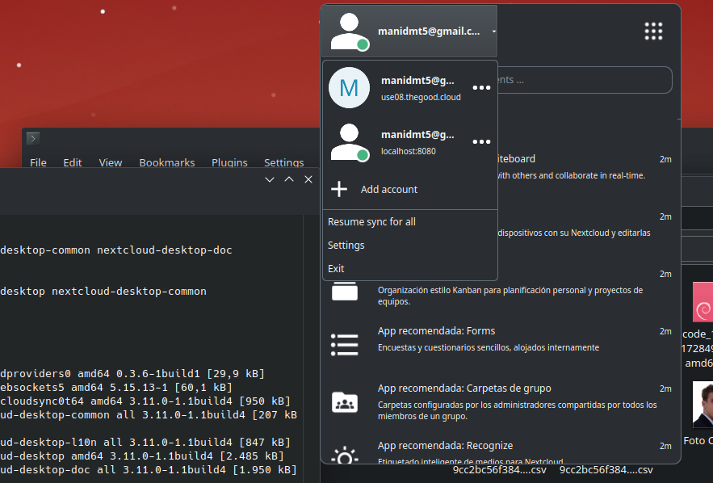
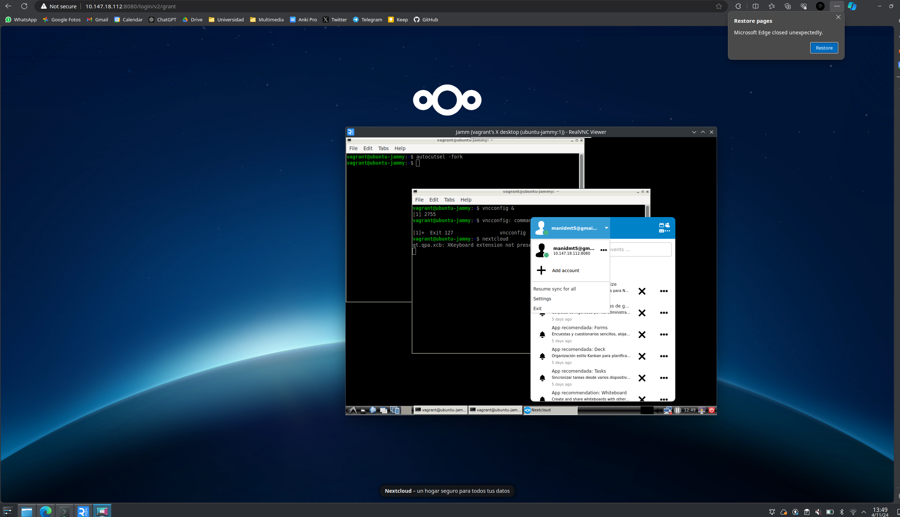

# Práctica 6: Almacenamiento sincronizado y compartido

**Autor**: Manuel Díaz-Meco Terrés

**Fecha**: 4 de noviembre 2024

## Introducción:

En esta práctica se usará Nextcloud y ZeroTier para sincronizar ficheros entre máquinas. 

## Levantar Contenedores y Servidor

En primer lugar, levantamos los contenedores necesarios para el desarrollo de la práctica a partir del archivo `docker-compose.yml`:

```dockerfile
services:
  db:
    image: mariadb:10.11
    restart: always
    command: --transaction-isolation=READ-COMMITTED --log-bin=binlog --binlog-format=ROW
    volumes:
      - db:/var/lib/mysql
    environment:
      - MYSQL_ROOT_PASSWORD=passwd_cpd2024
      - MYSQL_PASSWORD=passwd_cpd2024
      - MYSQL_DATABASE=nextcloud
      - MYSQL_USER=nextcloud

  redis:
    image: redis:alpine
    restart: always

  app:
    image: nextcloud
    restart: always
    ports:
      - 8080:80
    depends_on:
      - redis
      - db
    volumes:
      - nextcloud:/var/www/html
    environment:
      - MYSQL_PASSWORD=passwd_cpd2024
      - MYSQL_DATABASE=nextcloud
      - MYSQL_USER=nextcloud
      - MYSQL_HOST=db

volumes:
  nextcloud:
  db:
```

Ejecutamos `docker compose up -d`y comprobamos que se han levantado correctamente los contenedores de nextcloud y db:



Tras levantar los contenedores configuramos el servidor como se indica resultando:



## Clientes

Con el servidor ya montado, configuramos y añadimos los clientes. En primer lugar, modificamos el archivo `config/config.php` añadiendo lo siguiente:

```php
'trusted_domains' =>
    array(
		0 => 'localhost:8080'
    	1 => '10.147.18.112:8080'
),
```

Añadiendo así la IP con la que está el host en ZeroTier. De esta forma, el cliente de la máquina virtual Jammy, que está en el mismo ZeroTier que el host por la práctica anterior, podrá conectarse al servidor NextCloud sin problema.

Tras instalar el cliente tanto en el host como en la máquina virtual conectamos ambos al servidor:



Para la máquina virtual he tenido que hacer uso de `autocutsel` para poder copiar y pegar de RealVNC al host:

