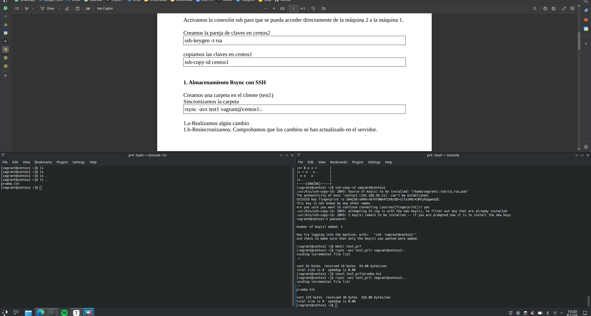
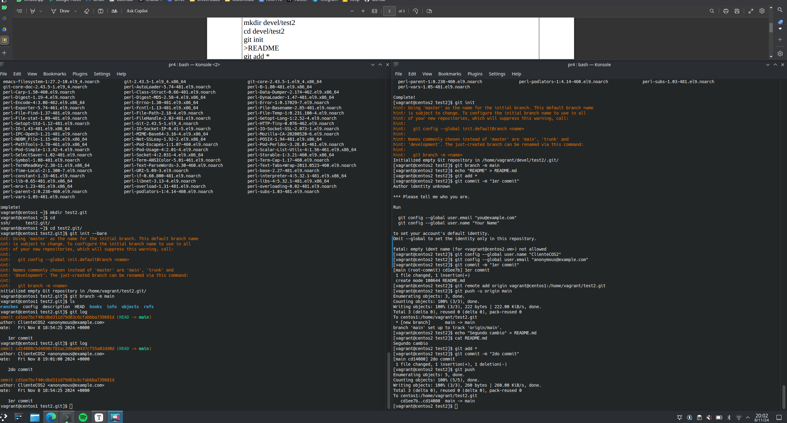
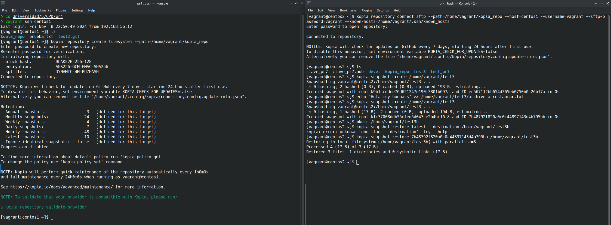
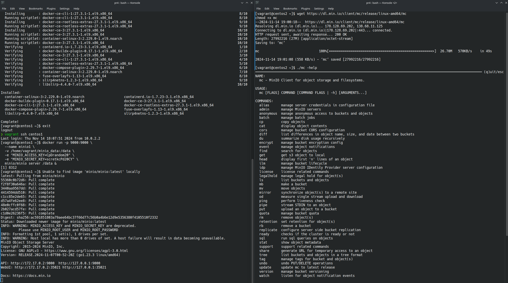
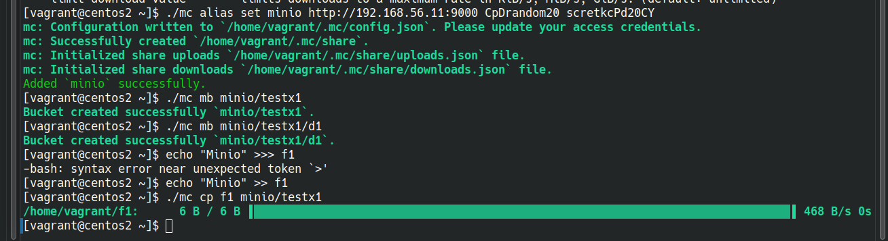

# Práctica 7: Copias de Seguridad

**Autor:** Manuel Díaz-Meco Terrés

**Fecha:** 17 de noviembre 2024

## Introducción

En esta práctica se buscan evaluar varios métodos de almacenamiento orientado a copias de seguirdad, usando herramientas como `rsync`, `Git`, `Kopia` y `Minio`.

## Rsync con SSH

En primer lugar generamos una copia pública y privada en el cliente `centos2` para poder realizar correctamente las operaciones mediante ssh. Esto lo hacemos mediante el comando `ssh-keygen -t rsa` y la pasamos al servidor con `ssh-copy-id vagrant@centos1`. Creamos la carpeta `test_pr7`y la sincronizamos con el comando `rsync -avz test_pr7 vagrant@centos1:.`, luego creamos un archivo de texto y vemos como se actualiza.

## Servidor Git

Tras instalar git en cliente y servidor e identificarnos en el cliente para poder hacer commit con `user.name = ClienteCOS2` y `user.email anonymous@example.com` ya podemos ejecutar los comandos que aparecen en el guión para configurar correctamente el servidor y cliente con git. Notar que he cambiado en ambos casos la rama de `master`a `main` por manía mía, no por otra cosa.

## Copias de seguridad con Kopia mediante SSH

Tras instalar kopia en `centos1 ` y  `centos2` lo indicado en https://kopia.io/docs/installation/ creamos un repositorio en el nodo servidor, `centos1`, al que nos conectamos desde el nodo cliente, `centos2`, mediante sftp. Una vez conectados creamos una *snapshot* de la carpeta `test3`, creamos un nuevo archivo y volvemos a hacer una *snapshot* para hacer la correcta copia incremental. Por último, copiamos todos los archivos guardados en el momento de hacer la segunda *snapshot* en la carpeta `test3b`gracias al uso del identificador de la *snapshot*.

## Instalación del servidor Minio para objetos S3 (Bucket)

En primer lugar, instalamos **docker** en el nodo servidor y salimos y entramos para que los cambios surtan efecto. Una vez que hemos vuelto a entrar en `centos1` corremos el contenedor docker dado en el pdf de la práctica. Con el contenedor en el nodo servidor ya activo procedemos a instalar el cliente de **minio** en `centos2` y a seguir los comandos que se indican en la práctica, todos ellos ejecutados sin ningún problema como se ve en las imágenes.

## (opcional) Utilizar el servidor Minio S3 como servidor para kopia

----
