# Práctica 8: Mecanismos de Seguridad para acceso a un servidor

**Autor:** Manuel Díaz-Meco Terrés

**Fecha:** 17 de noviembre 2024

## Introducción

El objetivo de esta práctica es saber configurar elementos adicionales de seguridad para reducir el riesgo de ataques por accesos no autorizados mediante un sistema Host IDS y añadir autenticación de segundo factor.

## Ejercicio 1: Fail2Ban

En primer lugar, inicializamos nuestra máquina de la práctica 5, la que usa *Jammy64* e instalamos **fail2ban** mediante `sudo apt install fail2ban`, tras esto hacemos lo siguiente:

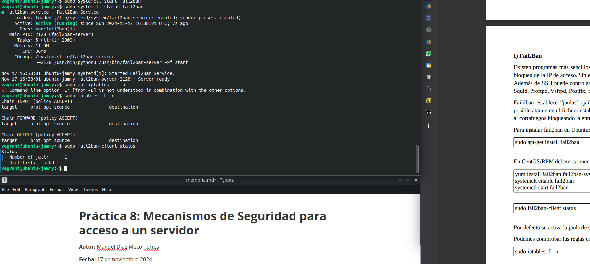

Ahora, comprobamos que el servicio funciona intentando entrar sin éxito 3 veces desde nuestro host. Como se ve en la siguiente imagen, tras hacer esto se banea nuestra dirección IP, pudiendo comprobar eso con el comando `sudo iptables -L -n`:

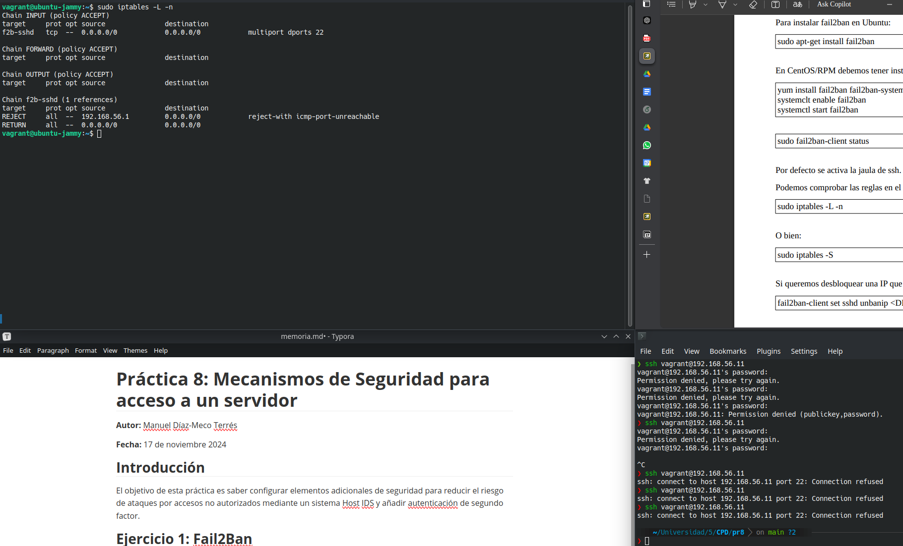

Para 'desbanear' la IP de nuestro host hemos de ejecutar `sudo fail2ban-client set sshd unbanip 192.168.56.1`, ya podremos acceder correctamente a la máquina *jammy* desde el host:

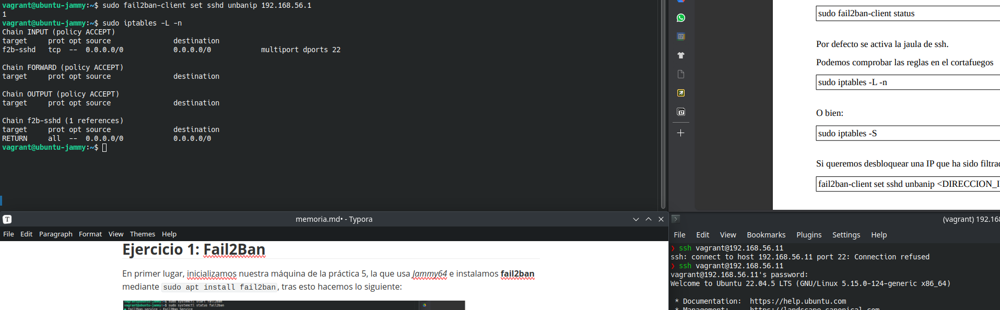

## Ejercicio 2: Instalación de Google Authenticator

---

## Opcional 1: Supervisión de NGINX medianet Fail2ban

Tras instalar correctamente **nginx** podemos ver que se ha instalado correctamente accediendo a [192.168.56.11](). Ahora configuramos usuario y contraseña mediante los comandos:

```bash
vagrant@ubuntu-jammy:~$ sudo sh -c "echo -n 'manolo:' >> /etc/nginx/.htpasswd"
vagrant@ubuntu-jammy:~$ sudo sh -c "openssl passwd -apr1 >> /etc/nginx/.htpasswd"
```

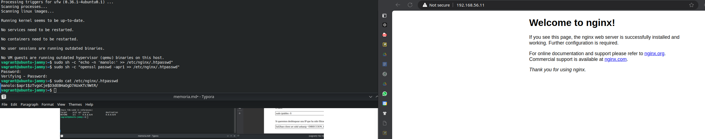

Ahora, debemos de configurar el archivo `/etc/nginx/sites-enabled/default` y añadir:

```php
 location / {
 try_files $uri $uri/ =404;
 auth_basic "Restricted Content";
 auth_basic_user_file /etc/nginx/.htpasswd;
 }
```

De esta forma cuando accedamos se nos pedirá usuario y contraseña. Recalcar que si se hace en el navegador se guarda la caché y ya no te lo vuelve a pedir. Por eso he accedido otra vez al servidor desde una página *InPrivate* o de incógnito.

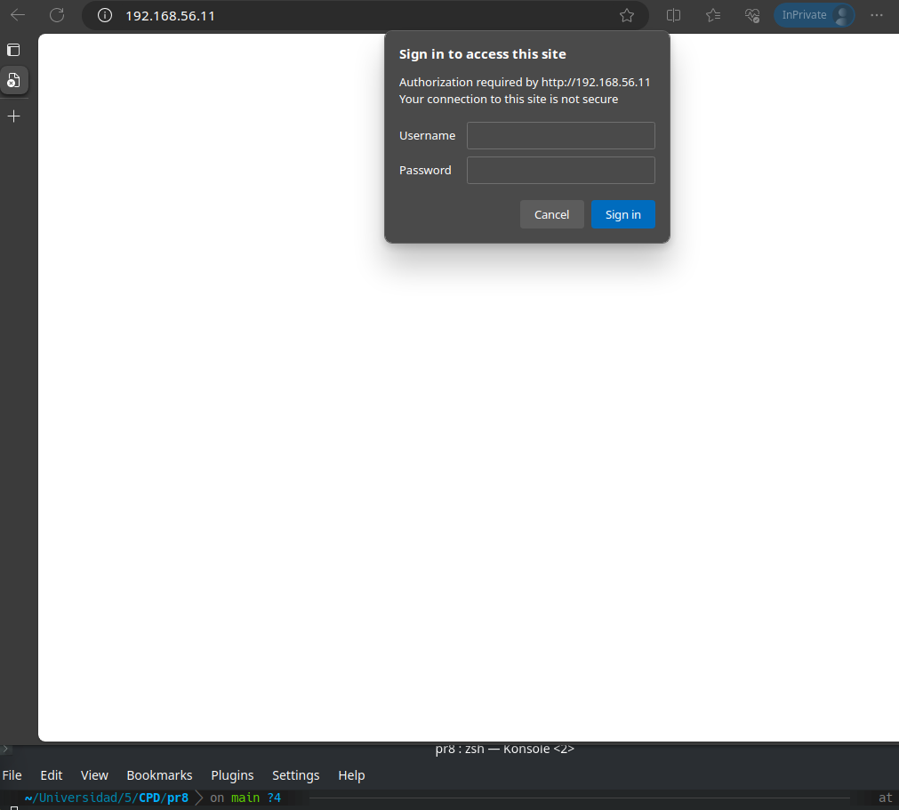

Ahora, editamos el archivo `/etc/fail2ban/jail.local`:


Y, tras intentar unas cuantas veces acceder erróneamente al servidor **nginx** obtendremos lo siguiente:

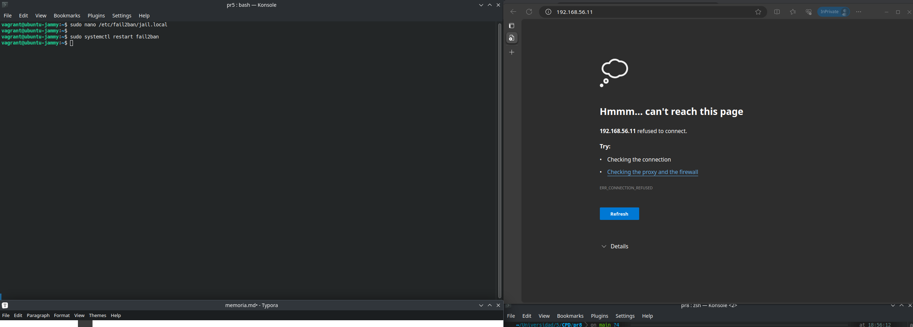

## Opcional 2: Utilizar la red TOR para acceder directamente a la máquina virtual

En primer lugar instalamos **tor** en la máquina *jammy* y modificamos el archivo `etc/tor/torrc` como se nos dice en el guión:

```php
RunAsDaemon 1
HiddenServiceDir /root/servicio1
HiddenServicePort 22 127.0.0.1:22
HiddenServicePort 80 127.0.0.1:80
```

Una vez hecho eso ejecutamos tor:

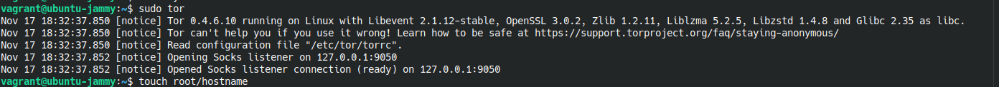

Con tor ya corriendo, instalamos en navegador de tor, **Tor Browser Bundle** desde su página web https://www.torproject.org/download/. Ejecutamos el navegador mediante el comando `./start-tor-browser`. En el navegador podremos acceder a nuestro servidor nginx poniendo lo que hay en el archivo `servicio1/hostname`:

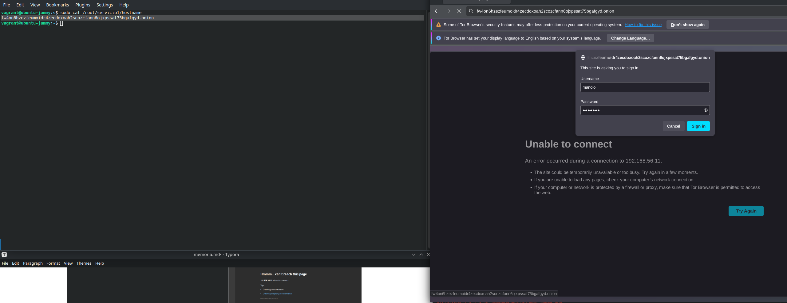

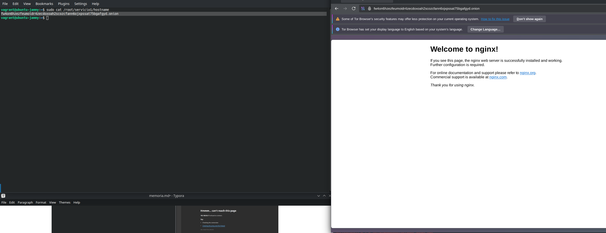

Ahora modificamos el archivo creado en la práctica 5 para el *proxyjump* `~/.ssh/config` como se indica en el guión:

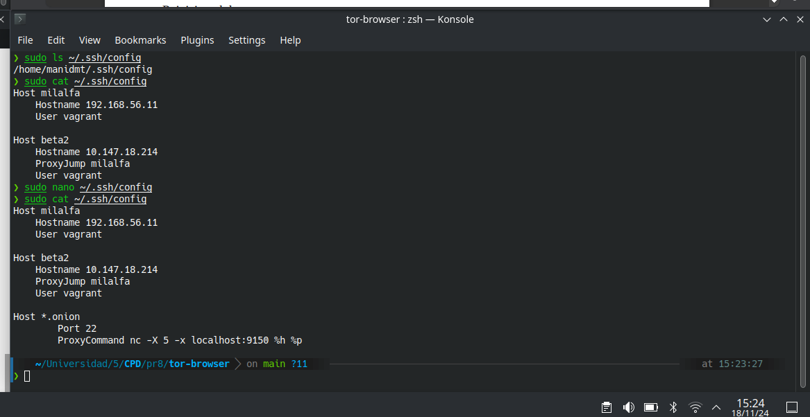

De esta forma podremos acceder a nuestra máquina *jammy* con `ssh vagrant@hostname.onion` de la misma forma con la que estabamos accediendo a ella con `ssh vagrant@192.168.56.11`. Antes de conectarnos hemos de modificar el archivo `/etc/ssh/sshd_config` para cambiar el valor de **PasswordAuthentication** a *yes*:

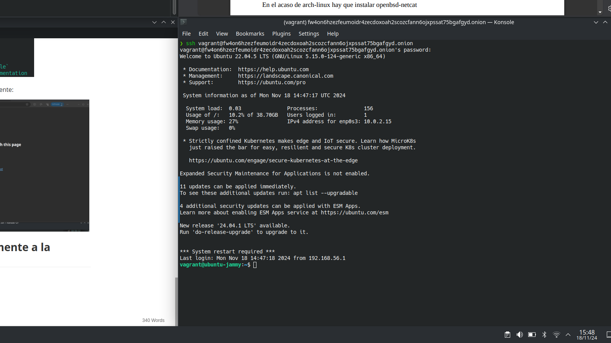

