# Práctica 9: Virtualización con LXD y gestión de alertas con Telegram

**Autor**: Manuel Díaz-Meco Terrés		

**Fecha**: 10 de diciembre 2024

## Introducción

En esta práctica se hará uso de LXD para crear un sistema de monitorización de múltiples nodos, utilizando Telegram como sistema rápido para aviso de alertas.

## Creación del entorno y contenedores

Lanzamos el comando `vagrant init ubuntu/jammy64` para crear el entrono correspondiente. Al hacer esto se nos creará nuestro *Vagrantfile* que tendremos que modificar como se indica en el guión. Yo he optado por usar la ip `192.168.56.10` ya que la que viene en el guión, `192.168.33.10`, no es aceptada.

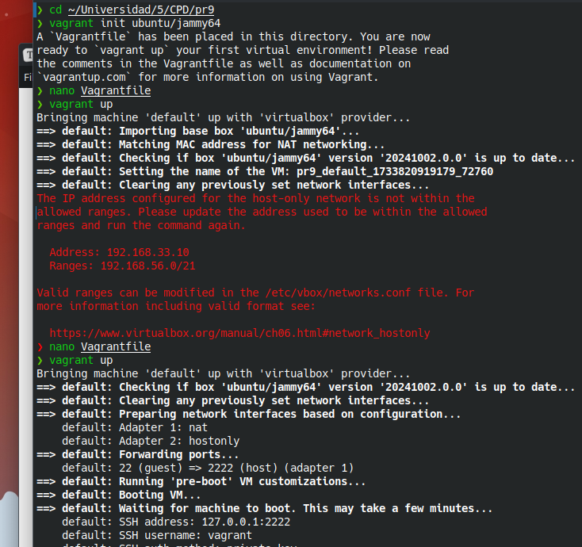

Ejecutando `vagrant ssh` estaremos dentro de la máquina virtual creada.  A continuación ejecutamos:

```bash
sudo apt update
sudo apt -y install zfsutils-linux
sudo lxd init
```

Las opciones seleccionadas del último comando son las siguientes:

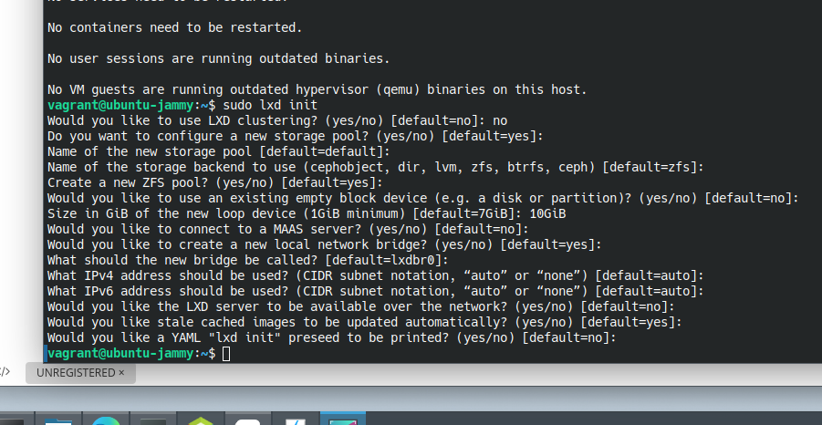

Añadimos el usuario al grupo *lxd* con `sudo usermod -a -G lxd vagrant` y salimos y volvemos a entrar para que se hagan efectivos los cambios. Ahora creamos un contenedor ubuntu, probamos que funciona y ver las imágenes del contenedor con los comandos:

```bash
lxc launch ubuntu: c0
lxc list
lxc image list
```

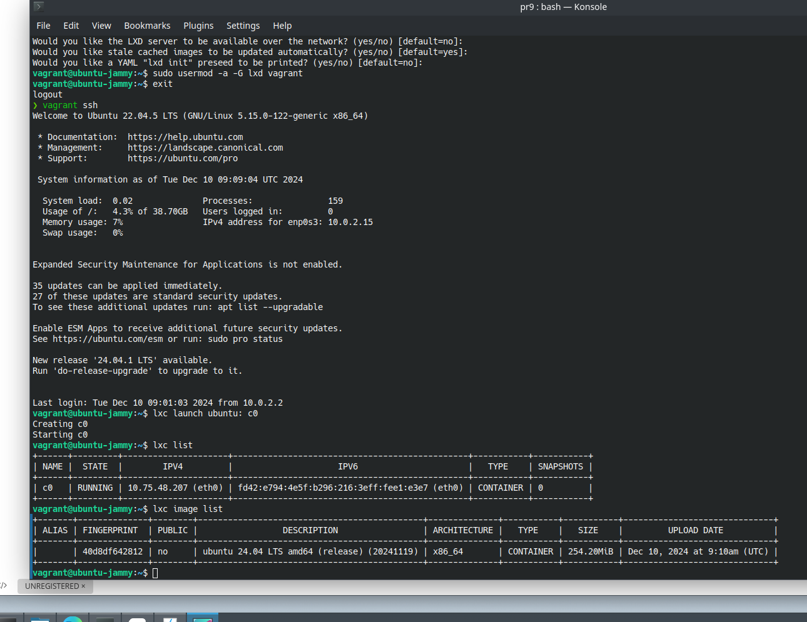

Añadimos mediante shell al contenedor y comprobamos la última versión de ubuntu:

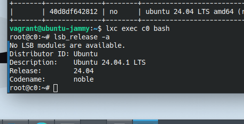

Ahora copiamos 'duplicamos' este contenedor y lo llamamos c1. Hacemos lo mismo que antes, solo que el contenedor está parado en el momento de su creación, por lo que hay que arrancarlo. Tras esto lo paramos y borramos y vemos el resultado:

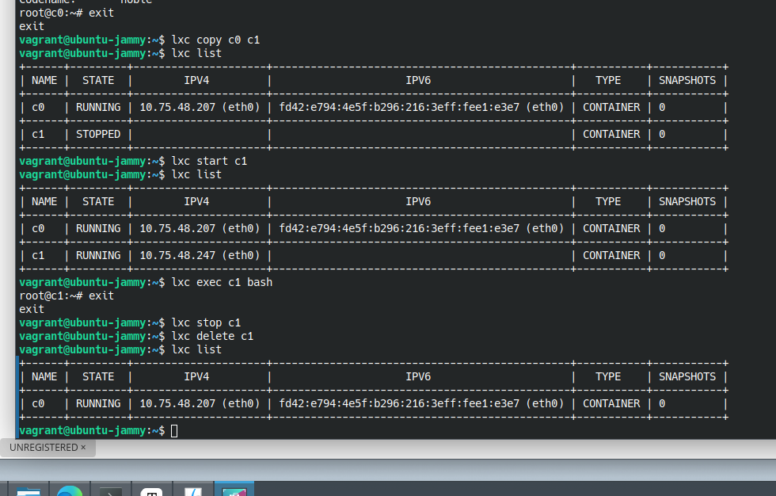

Parece ser que el servidor de *images* por defecto ya no está vacío, como se indica en el guión. Por ello, procedemos sin utilizar el otro repositorio que se indica. Ejecutamos:

```bash
lxc remote list
lxc image list images: | head
lxc image list images: 'alpine'
```

De esta forma podemos ver las imágenes que hay disponibles o consular las que hay con una palabra clave, como vemos en el tercer comando.

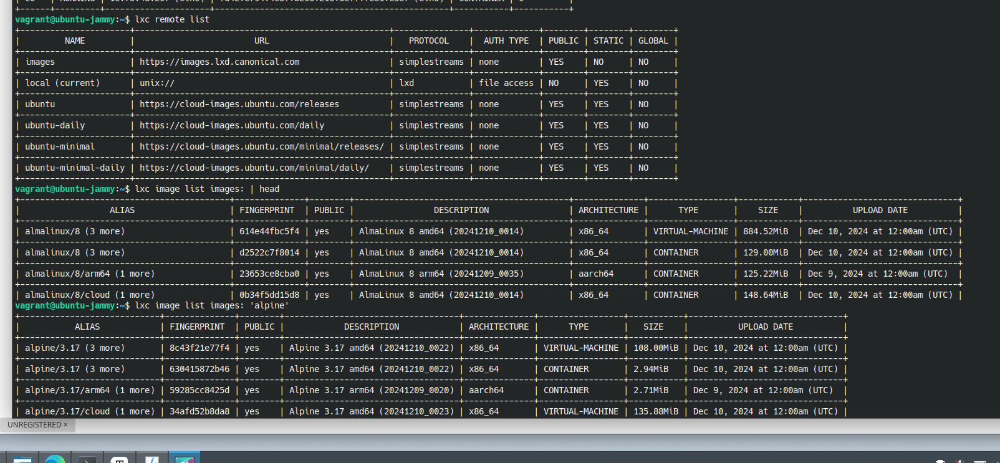

Creamos ahora un contenedor basado en *CentOS9* llamado c2, ya que LXD está orientado a definir contenedores con un sistema operativo:

```bash
lxc launch images:centos/9-Stream c2
lxc exec c2 bash
[root@c2 ~]# more /etc/redhat-release 
```

Con el último comando se comprueba la versión del sistema operativo.

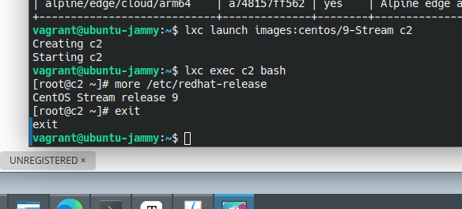

Para comprobar la conexión entre ambos contenedores debemos ver su ip y conectarnos desde uno de ellos al otro mediante el uso de `ping`:

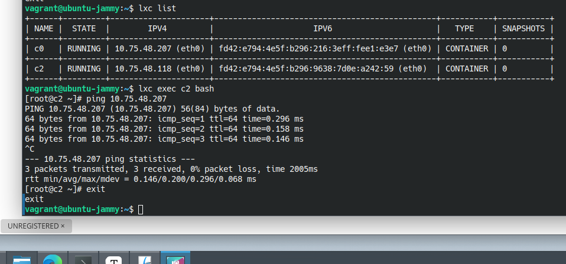

Ahora, para crear un directorio compartido entre el host y alguno de los contenedores debemos proceder como sigue:

```bash
mkdir disco1
lxc config device add c2 disco1 disk source=/home/vagrant/disco1 path=/mnt/disco1
```

Y probamos que efectivamente hemos creado un directorio compartido:

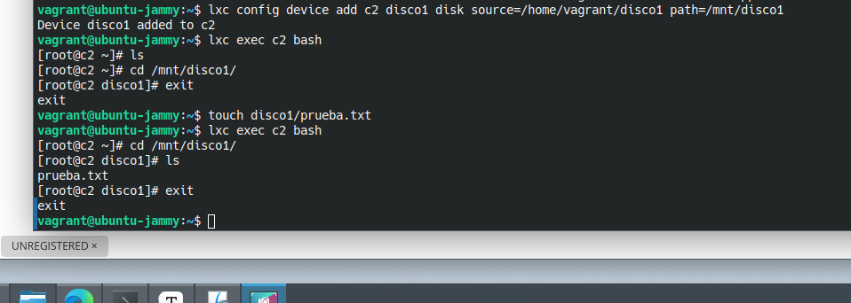

Para dar acceso de lectura y escritura hay que comprobar los permisos del propietario del contenedor mediante `sudo ls -l /var/lib/lxd/containers`.

Para limitar los recursos de un contenedor, en este caso la memoria, y realizar las comprobaciones de la correcta limitación ejecutamos:

```bash
lxc config set c0 limits.memory 512MB
lxc config show c1
lxc exec c0 bash
[root@c0 ~]# free -m 
```

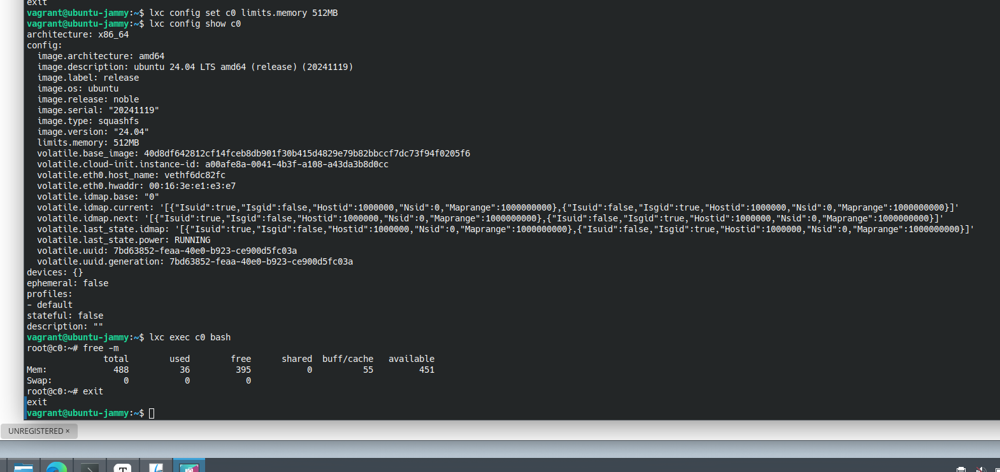

Crearemos ahora un *backup* de uno de nuestros contenedores y realizaremos algunos de los comandos que se muestran en el guión:

```bash
lxc snapshot c0 backup_c0
lxc restore c0 backup_c0 
lxc move c0/backup_c0 c0/backup-c0
lxc info c0
lxc copy c0/backup-c0 c1
lxc delete c0/backup-c0
```

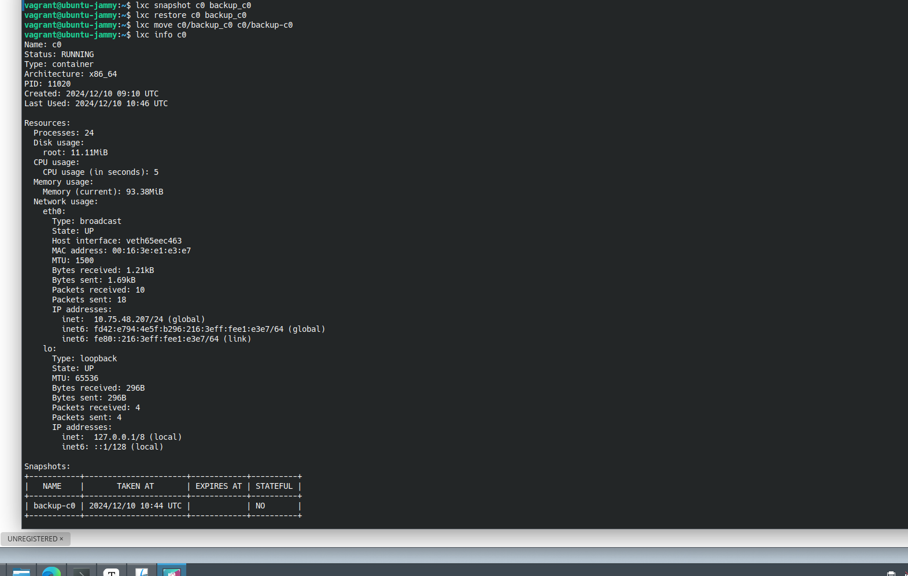

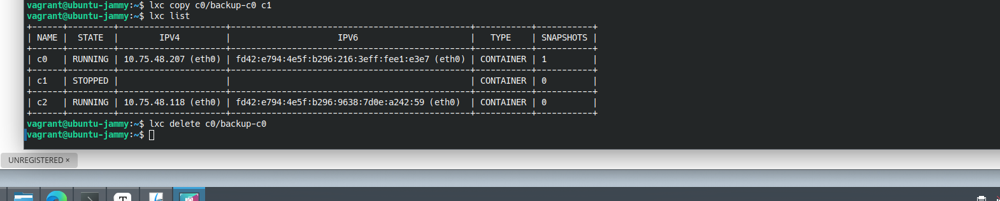

Para añadir una interfaz en modo *bridge*  a uno de nuestros contenedores ejecutamos: `lxc config device add c2 eth1 nic nictype=bridged parent=lxdbr0`.

## Uso de Bot de Telegram

Antes de nada vamos crear el bot haciendo uso del ususario *BotFather*:

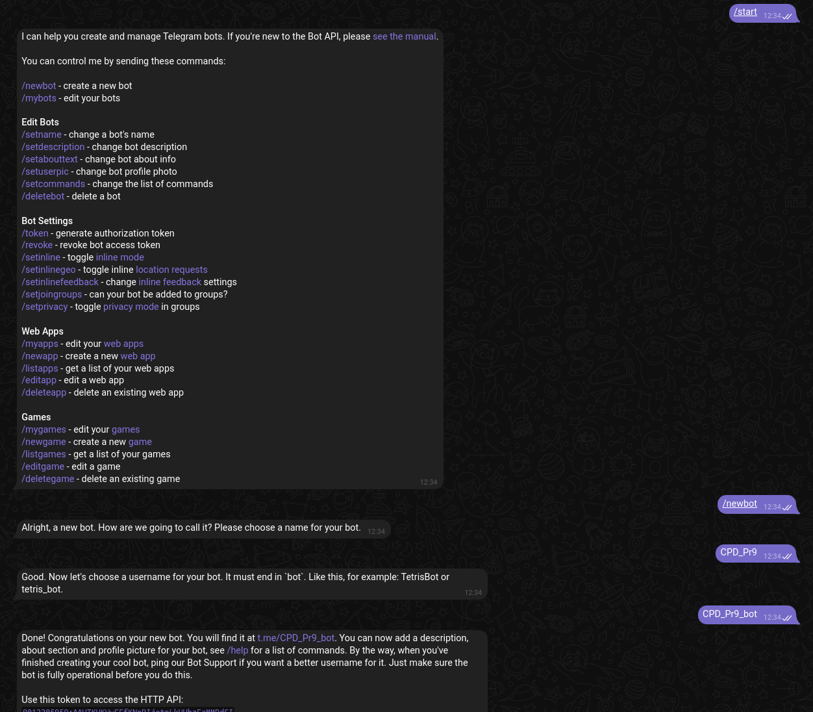

Una vez creado ejecutamos los siguientes comandos para tener todo listo para la creación de cada uno de los 4 bots:

```bash
cd Bot_Telegram
python3 -m venv env
source env/bin/activate
sudo apt install libssl-dev
pip install python-telegram-bot --pre
pip install command
```

### Bot1

El código del primer bot será el dado en el guión:

```python
from telegram import Update
from telegram.ext import ApplicationBuilder, CommandHandler, ContextTypes
import command

def ejecuta_w():
    res = command.run(['ls'])
    print(res.output)
    return str(res.output)

async def hello(update: Update, context: ContextTypes.DEFAULT_TYPE) -> None:
        await update.message.reply_text(f'Hello {update.effective_user.first_name}')
async def resp_ls(update: Update, context: ContextTypes.DEFAULT_TYPE) -> None:
        await update.message.reply_text(ejecuta_w())

app = ApplicationBuilder().token("8012205959:AAHTKUKWwEEfKNnRIjetpLkUHbzFaMMDdSI").build()
app.add_handler(CommandHandler("hello", hello))
app.add_handler(CommandHandler("ls", resp_ls))
app.run_polling()
```

### Bot2

Para crear el bot que cuente con la función para comprobar la respuesta de ping haremos uso del paquete `icmplib`. También necesitaremos habilitar nuestro proceso pueda usar sockets de red:

```bash
pip install icmplib
echo 'net.ipv4.ping_group_range = 0 2147483647' | sudo tee -a /etc/sysctl.conf
sudo sysctl -p
```

Una vez tenemos todo esto ya podremos usar el bot2:
```python
from telegram import Update
from telegram.ext import ApplicationBuilder, CommandHandler, ContextTypes
from telegram.constants import ParseMode
import command
from icmplib import ping, NameLookupError, ICMPError


def ejecuta_w():
    res = command.run(['ls'])
    print(res.output)
    return str(res.output)

def check_ping(host):
    try:
        return ping(host, privileged=False, count=1).is_alive
    except NameLookupError:
        return "DNS_ERROR"
    except ICMPError:
        return "ICMP_ERROR"
    except Exception:
        return "UNKNOWN_ERROR"
    

async def start(update: Update, context: ContextTypes.DEFAULT_TYPE) -> None:
    welcome_message = (
        "*Este es el Bot de Manuel Díaz-Meco creado para la práctica 9 de la asignatura CPD.*\n\n"
        "Estos son los comandos:\n\n"
        "• `/start` - Muestra este mensaje de bienvenida.\n"
        "• `/ping <dirección_ip_o_dominio>` - Realiza un ping al host especificado y comprueba si responde.\n\n"
    )
    await update.message.reply_text(text=welcome_message, parse_mode=ParseMode.MARKDOWN)

async def resp_ls(update: Update, context: ContextTypes.DEFAULT_TYPE) -> None:
    await update.message.reply_text(ejecuta_w())

async def ping_command(update: Update, context: ContextTypes.DEFAULT_TYPE) -> None:
    if len(context.args) == 0:
        message = ("Por favor, proporcionar una dirección IP o dominio después del comando /ping\n\n"
                    "El uso es el siguiente: `/ping <dirección_ip_o_dominio>`")
        await update.message.reply_text(text=message,
        parse_mode=ParseMode.MARKDOWN)
        return

    host = context.args[0]

    result = check_ping(host)

    if result is True:
        await update.message.reply_text(text=f"El host `{host}` está respondiendo", parse_mode=ParseMode.MARKDOWN)
    elif result == "DNS_ERROR":
        await update.message.reply_text(text=f"No se pudo resolver el nombre de dominio: `{host}`", parse_mode=ParseMode.MARKDOWN)
    elif result == "ICMP_ERROR":
        await update.message.reply_text(text=f"Ocurrió un error ICMP al intentar hacer ping a `{host}`", parse_mode=ParseMode.MARKDOWN)
    elif result == "UNKNOWN_ERROR":
        await update.message.reply_text(text=f"Ocurrió un error desconocido al intentar hacer ping a {host}",parse_mode=ParseMode.MARKDOWN)
    else:
        await update.message.reply_text(text=f"No se pudo hacer ping al host {host}.", parse_mode=ParseMode.MARKDOWN)
        
app = ApplicationBuilder().token("8012205959:AAHTKUKWwEEfKNnRIjetpLkUHbzFaMMDdSI").build()
app.add_handler(CommandHandler("start", start))
app.add_handler(CommandHandler("ping", ping_command))
app.run_polling()
```


### Bot3

Ahora modificaremos el código anterior para que se haga una comprobación con `ping` a la página oficial de la ugr cada minuto. Tendremos que utilizar el paquete `python-telegram-bot[job-queue]`:

```bash
pip install "python-telegram-bot[job-queue]"
```

Ahora, podemos ejecuitar el bot3:
```python
from datetime import timedelta
from telegram import Update
from telegram.ext import ApplicationBuilder, CommandHandler, ContextTypes
from telegram.constants import ParseMode
import command
from icmplib import ping, NameLookupError, ICMPError


def ejecuta_w():
    res = command.run(['ls'])
    print(res.output)
    return str(res.output)

def check_ping(host):
    try:
        return ping(host, privileged=False, count=1).is_alive
    except NameLookupError:
        return "DNS_ERROR"
    except ICMPError:
        return "ICMP_ERROR"
    except Exception:
        return "UNKNOWN_ERROR"
    

async def start(update: Update, context: ContextTypes.DEFAULT_TYPE) -> None:
    welcome_message = (
        "*Este es el Bot de Manuel Díaz-Meco creado para la práctica 9 de la asignatura CPD.*\n\n"
        "Estos son los comandos:\n\n"
        "• `/start` - Muestra este mensaje de bienvenida.\n"
        "• `/ping <dirección_ip_o_dominio>` - Realiza un ping al host especificado y comprueba si responde.\n\n"
        "• `/start_ping_ugr` - Realiza un monitoreo a `ugr.es`. Serás notificado del estado del servidor cada minuto.\n\n"
        "• `/stop_ping_ugr` - Dejarás de estar notificado del estado del servidor `ugr.es` cada minuto.\n\n"
    )
    await update.message.reply_text(text=welcome_message, parse_mode=ParseMode.MARKDOWN)

async def resp_ls(update: Update, context: ContextTypes.DEFAULT_TYPE) -> None:
    await update.message.reply_text(ejecuta_w())

async def ping_command(update: Update, context: ContextTypes.DEFAULT_TYPE) -> None:
    if len(context.args) == 0:
        message = ("Por favor, proporcionar una dirección IP o dominio después del comando /ping\n\n"
                    "El uso es el siguiente: `/ping <dirección_ip_o_dominio>`")
        await update.message.reply_text(text=message,
        parse_mode=ParseMode.MARKDOWN)
        return

    host = context.args[0]

    result = check_ping(host)

    if result is True:
        await update.message.reply_text(text=f"El host `{host}` está respondiendo", parse_mode=ParseMode.MARKDOWN)
    elif result == "DNS_ERROR":
        await update.message.reply_text(text=f"No se pudo resolver el nombre de dominio: `{host}`", parse_mode=ParseMode.MARKDOWN)
    elif result == "ICMP_ERROR":
        await update.message.reply_text(text=f"Ocurrió un error ICMP al intentar hacer ping a `{host}`", parse_mode=ParseMode.MARKDOWN)
    elif result == "UNKNOWN_ERROR":
        await update.message.reply_text(text=f"Ocurrió un error desconocido al intentar hacer ping a {host}",parse_mode=ParseMode.MARKDOWN)
    else:
        await update.message.reply_text(text=f"No se pudo hacer ping al host {host}.", parse_mode=ParseMode.MARKDOWN)
        
# Función nueva: Hacer check a la dirección de la ugr
async def check_ugr_ping(context: ContextTypes.DEFAULT_TYPE):
    chat_id = context.job.data['chat_id']
    result = check_ping('ugr.es') #Hacemos ping a ugr.es
    if result is True:
        message = "El host `ugr.es` está respondiendo"
    elif result == "DNS_ERROR":
        message = "No se pudo resolver el nombre de dominio: `ugr.es`"
    elif result == "ICMP_ERROR":
        message = "Ocurrió un error ICMP al intentar hacer ping a `ugr.es`"
    elif result == 'UNKNOWN_ERROR':
        message = "Ocurrió un error desconocido al intentar hacer ping a `ugr.es`"
    else:
        message = "No se pudo hacer ping al host `ugr.es`"
    await context.bot.send_message(chat_id=chat_id, text=message, parse_mode=ParseMode.MARKDOWN)


# Función nueva: Hacer ping a la dirección de la ugr cada minuto
async def start_ugr_ping(update: Update, context: ContextTypes.DEFAULT_TYPE):
    chat_id = update.effective_chat.id
    context.job_queue.run_repeating(check_ugr_ping, interval=timedelta(minutes=1), first=10, data={'chat_id': chat_id})
    await update.message.reply_text("Se ha iniciado el monitoreo de ping a `ugr.es`. Recibirás actualizaciones cada minuto.")
    
# Función nueva: Dejar de hacer ping a la dirección de la ugr
async def stop_ugr_ping(update: Update, context: ContextTypes.DEFAULT_TYPE):
    chat_id = update.effective_chat.id
    current_jobs = context.job_queue.get_jobs_by_name('check_ugr_ping')
    job_removed = False
    for job in current_jobs:
        if job.data['chat_id'] == chat_id:
            job.schedule_removal()
            job_removed = True
            break
        if job_removed:
            await update.message.reply_text("Se ha detenido el monitoreo de ping a `ugr.es` para este chat", parse_mode= ParseMode.MARKDOWN)
        else:
            await update.message.reply_text("No se encontró ningún monitoreo activo para este chat")

app = ApplicationBuilder().token("8012205959:AAHTKUKWwEEfKNnRIjetpLkUHbzFaMMDdSI").build()
app.add_handler(CommandHandler("start", start))
app.add_handler(CommandHandler("ping", ping_command))
app.add_handler(CommandHandler("start_ping_ugr", start_ugr_ping))
app.add_handler(CommandHandler("stop_ugr_ping", stop_ugr_ping))
app.run_polling()
```


### Bot4

Esta es la versión final de nuestro bot, podrá ejecutar comandos en la *shell* de nuestro ordenador y mandar la respuesta al bot de Telegram

```python
from datetime import timedelta
from telegram import Update
from telegram.ext import ApplicationBuilder, CommandHandler, ContextTypes
from telegram.constants import ParseMode
import command
from icmplib import ping, NameLookupError, ICMPError

# Función nueva: Ejecuta el comando que se indique tras /w
def ejecuta_w(comando):
    try:
        res = command.run([comando])
        print(res.output)
        return str(res.output)
    except Exception as e:
        print(f"Ocurrió un error inesperado: {e}")
        return f"Error inesperado: {e}"

def check_ping(host):
    try:
        return ping(host, privileged=False, count=1).is_alive
    except NameLookupError:
        return "DNS_ERROR"
    except ICMPError:
        return "ICMP_ERROR"
    except Exception:
        return "UNKNOWN_ERROR"
    

async def start(update: Update, context: ContextTypes.DEFAULT_TYPE) -> None:
    welcome_message = (
        "*Este es el Bot de Manuel Díaz-Meco creado para la práctica 9 de la asignatura CPD.*\n\n"
        "Estos son los comandos:\n\n"
        "• `/start` - Muestra este mensaje de bienvenida.\n"
        "• `/ping <dirección_ip_o_dominio>` - Realiza un ping al host especificado y comprueba si responde.\n\n"
        "• `/start_ping_ugr` - Realiza un monitoreo a `ugr.es`. Serás notificado del estado del servidor cada minuto.\n\n"
        "• `/stop_ping_ugr` - Dejarás de estar notificado del estado del servidor `ugr.es` cada minuto.\n\n"
        "• `/w <ordenes_a_ejecutar>` - Procesará las órdenes dadas por el shell y devolverá la respuesta.\n\n"
    )
    await update.message.reply_text(text=welcome_message, parse_mode=ParseMode.MARKDOWN)

async def resp_ls(update: Update, context: ContextTypes.DEFAULT_TYPE) -> None:
    await update.message.reply_text(ejecuta_w())

async def ping_command(update: Update, context: ContextTypes.DEFAULT_TYPE) -> None:
    if len(context.args) == 0:
        message = ("Por favor, proporcionar una dirección IP o dominio después del comando /ping\n\n"
                    "El uso es el siguiente: `/ping <dirección_ip_o_dominio>`")
        await update.message.reply_text(text=message,
        parse_mode=ParseMode.MARKDOWN)
        return

    host = context.args[0]

    result = check_ping(host)

    if result is True:
        await update.message.reply_text(text=f"El host `{host}` está respondiendo", parse_mode=ParseMode.MARKDOWN)
    elif result == "DNS_ERROR":
        await update.message.reply_text(text=f"No se pudo resolver el nombre de dominio: `{host}`", parse_mode=ParseMode.MARKDOWN)
    elif result == "ICMP_ERROR":
        await update.message.reply_text(text=f"Ocurrió un error ICMP al intentar hacer ping a `{host}`", parse_mode=ParseMode.MARKDOWN)
    elif result == "UNKNOWN_ERROR":
        await update.message.reply_text(text=f"Ocurrió un error desconocido al intentar hacer ping a {host}",parse_mode=ParseMode.MARKDOWN)
    else:
        await update.message.reply_text(text=f"No se pudo hacer ping al host {host}.", parse_mode=ParseMode.MARKDOWN)
        

async def check_ugr_ping(context: ContextTypes.DEFAULT_TYPE):
    chat_id = context.job.data['chat_id']
    result = check_ping('ugr.es') #Hacemos ping a ugr.es
    if result is True:
        message = "El host `ugr.es` está respondiendo"
    elif result == "DNS_ERROR":
        message = "No se pudo resolver el nombre de dominio: `ugr.es`"
    elif result == "ICMP_ERROR":
        message = "Ocurrió un error ICMP al intentar hacer ping a `ugr.es`"
    elif result == 'UNKNOWN_ERROR':
        message = "Ocurrió un error desconocido al intentar hacer ping a `ugr.es`"
    else:
        message = "No se pudo hacer ping al host `ugr.es`"
    await context.bot.send_message(chat_id=chat_id, text=message, parse_mode=ParseMode.MARKDOWN)


async def start_ugr_ping(update: Update, context: ContextTypes.DEFAULT_TYPE):
    chat_id = update.effective_chat.id
    context.job_queue.run_repeating(check_ugr_ping,
    interval=timedelta(minutes=1), first=10, data={'chat_id': chat_id})
    await update.message.reply_text("Se ha iniciado el monitoreo de ping a `ugr.es`. Recibirás actualizaciones cada minuto.")

    
async def stop_ugr_ping(update: Update, context: ContextTypes.DEFAULT_TYPE):
    chat_id = update.effective_chat.id
    current_jobs = context.job_queue.get_jobs_by_name('check_ugr_ping')
    job_removed = False
    for job in current_jobs:
        if job.data['chat_id'] == chat_id:
            job.schedule_removal()
            job_removed = True
            break
    if job_removed:
        await update.message.reply_text("Se ha detenido el monitoreo de ping a `ugr.es` para este chat", parse_mode= ParseMode.MARKDOWN)
    else:
        await update.message.reply_text("No se encontró ningún monitoreo activo para este chat")

# Función nueva: Permite correr un comando de la shell de nuestro ordenador        
async def correr_orden(update: Update, context: ContextTypes.DEFAULT_TYPE) -> None:
    if (context.args) == 0:
        message = ("Por favor, proporcionar una orden después del comando /w\n\n"
        "El uso es el siguiente: `/w <ordenes_a_ejecutar>`")
        await update.message.reply_text(text=message,parse_mode=ParseMode.MARKDOWN)
        return
    orden = context.args[0]
    await update.message.reply_text(ejecuta_w(orden))

app = ApplicationBuilder().token("8012205959:AAHTKUKWwEEfKNnRIjetpLkUHbzFaMMDdSI").build()
app.add_handler(CommandHandler("start", start))
app.add_handler(CommandHandler("ping", ping_command))
app.add_handler(CommandHandler("start_ping_ugr", start_ugr_ping))
app.add_handler(CommandHandler("stop_ping_ugr", stop_ugr_ping))
app.add_handler(CommandHandler("w", correr_orden))
app.run_polling()
```

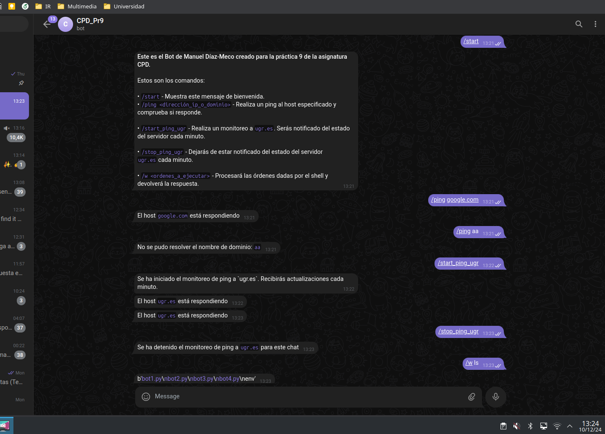

